# Mã Mermaid cho phần đặc tả use case (Chương 3, bản sửa 20-10)

Cập nhật 2026-10-20 (lần 2: thêm UC35, bài mẫu Speaking ở UC05/UC21) theo `tai-lieu/Chương 3 - Phân tích và thiết kế hệ thống mới (sửa 20-10 lần 2).docx` (35 UC, 4 tác nhân) và các quyết định đã chốt trong `log.md`.

Gồm: 1 sơ đồ use case tổng quan, 35 sơ đồ hoạt động (activity, 2 làn: tác nhân và Hệ thống), 35 sơ đồ tuần tự (sequence: tác nhân, Giao diện, Backend, Dịch vụ xác thực, CSDL, Kho lưu trữ tệp). Mỗi sơ đồ còn có file `.mmd` riêng và ảnh `.png` cùng tên trong thư mục `hoat-dong/`, `tuan-tu/`.

Quy ước: Dịch vụ xác thực là Supabase Auth, Kho lưu trữ tệp là Supabase Storage, CSDL là PostgreSQL qua Prisma (Chương 2). Nhánh `alt`/`opt` trong sơ đồ tuần tự ứng với Alternative Flow và Exception của đặc tả.

Xem nhanh hoặc sửa: dán mã vào https://mermaid.live. Xuất ảnh lại: `npx -p @mermaid-js/mermaid-cli mmdc -i UC01.mmd -o UC01.png -s 2 -b white`.

## Tổng quan – Sơ đồ use case (Hình 3.2)

### Sơ đồ use case tổng quan

```mermaid
flowchart LR
    K(["👤 Khách"])
    L(["👤 Người học"])
    ND(["👤 Người dùng (trừu tượng)"])
    GV(["👤 Giáo viên"])
    QL(["👤 Quản lý"])

    subgraph SYS["Nền tảng hỗ trợ học tập và ôn luyện IELTS"]
        direction TB
        subgraph G1[" "]
            direction TB
            UC03(["UC03 Xem trang giới thiệu"])
            UC04(["UC04 Đăng ký tài khoản"])
            UC05(["UC05 Xem bài mẫu"])
            UC27(["UC27 Xem thư viện đề"])
            UC28(["UC28 Tra cứu thư viện từ vựng"])
        end
        subgraph G2[" "]
            direction TB
            UC01(["UC01 Đăng nhập"])
            UC26(["UC26 Khôi phục mật khẩu"])
            UC02(["UC02 Đăng xuất"])
            UC06(["UC06 Quản lý thông tin cá nhân"])
            UC14(["UC14 Tùy chỉnh giao diện"])
            UC35(["UC35 Xem và quản lý thông báo"])
        end
        subgraph G3[" "]
            direction TB
            UC07(["UC07 Làm bài kiểm tra"])
            UC08(["UC08 Luyện tập theo dạng câu hỏi"])
            UC09(["UC09 Xem kết quả và lời giải"])
            UC10(["UC10 Hoàn thành và lưu bài W/S"])
            UC34(["UC34 Gửi yêu cầu hỗ trợ chấm W/S"])
            UC33(["UC33 Tải bài làm W/S"])
            UC11(["UC11 Xem nhận xét của Giáo viên"])
            UC12(["UC12 Ôn tập từ vựng bằng flashcard"])
            UC29(["UC29 Quản lý từ yêu thích"])
            UC30(["UC30 Quản lý ghi chú và nhãn từ vựng"])
            UC13(["UC13 Xem lịch sử và thống kê"])
            UC31(["UC31 Thiết lập mục tiêu học tập"])
            UC32(["UC32 Xem thông điệp động lực"])
        end
        subgraph G4[" "]
            direction TB
            UC15(["UC15 Xem hàng đợi bài chờ chấm"])
            UC16(["UC16 Chấm bài Writing/Speaking"])
            UC17(["UC17 Xem lịch sử bài đã chấm"])
        end
        subgraph G5[" "]
            direction TB
            UC18(["UC18 Theo dõi hoạt động hỗ trợ chấm"])
            UC19(["UC19 Quản lý người dùng"])
            UC20(["UC20 Quản lý Bộ đề và Đề thi"])
            UC21(["UC21 Quản lý bài mẫu"])
            UC22(["UC22 Quản lý từ vựng"])
            UC23(["UC23 Nhập dữ liệu hàng loạt"])
            UC24(["UC24 Kiểm tra hợp lệ dữ liệu"])
            UC25(["UC25 Xem thống kê hệ thống"])
        end
    end

    %% Tổng quát hóa (kế thừa)
    L -- "kế thừa" --> K
    L -- "kế thừa" --> ND
    GV -- "kế thừa" --> ND
    QL -- "kế thừa" --> ND

    K --- UC03 & UC04 & UC05 & UC27 & UC28
    ND --- UC01 & UC26 & UC02 & UC06 & UC14 & UC35
    L --- UC07 & UC08 & UC09 & UC10 & UC34 & UC33 & UC11 & UC12 & UC29 & UC30 & UC13 & UC31 & UC32
    GV --- UC15 & UC16 & UC17
    QL --- UC18 & UC19 & UC20 & UC21 & UC22 & UC23 & UC24 & UC25

    UC26 -. "«extend»" .-> UC01
    UC34 -. "«extend»" .-> UC10
    UC23 -. "«include»" .-> UC24

    classDef actor fill:#fff,stroke:#333,stroke-width:2px,font-weight:bold
    classDef guest fill:#e3e8f0,stroke:#1f3a5f
    classDef common fill:#f2f2f2,stroke:#777
    classDef learner fill:#e2ecfb,stroke:#2f6bd1
    classDef teacher fill:#fdeee6,stroke:#e07a3f
    classDef admin fill:#e1f4ec,stroke:#1f9468
    class K,L,ND,GV,QL actor
    class UC03,UC04,UC05,UC27,UC28 guest
    class UC01,UC26,UC02,UC06,UC14,UC35 common
    class UC07,UC08,UC09,UC10,UC34,UC33,UC11,UC12,UC29,UC30,UC13,UC31,UC32 learner
    class UC15,UC16,UC17 teacher
    class UC18,UC19,UC20,UC21,UC22,UC23,UC24,UC25 admin
    style G1 fill:none,stroke:none
    style G2 fill:none,stroke:none
    style G3 fill:none,stroke:none
    style G4 fill:none,stroke:none
    style G5 fill:none,stroke:none
```

Ghi chú: Mermaid không có loại sơ đồ use case riêng, nên mã này dùng `flowchart` để mô phỏng (tác nhân là nút có biểu tượng người, use case là hình bầu dục). Bản vẽ chính thức trong báo cáo vẫn là Hình 3.2 (`tai-lieu/hinh-3.2-uc-tong-quan.png`); mã này giữ cùng tác nhân, liên kết và quan hệ để team sửa nhanh khi cần.
## UC01 – Đăng nhập

### Sơ đồ hoạt động

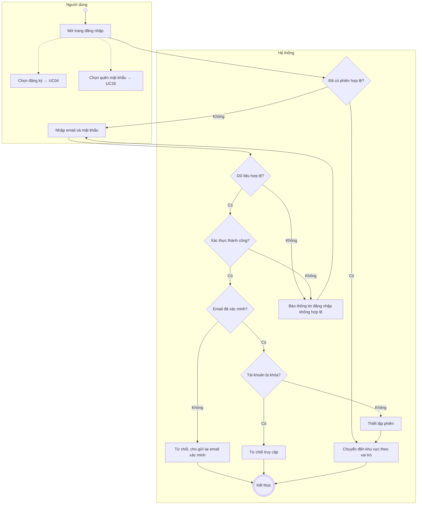
```mermaid
flowchart TD
    subgraph ND["Người dùng"]
        S((" ")) --> A1["Mở trang đăng nhập"]
        A2["Nhập email và mật khẩu"]
        A3["Chọn đăng ký → UC04"]
        A4["Chọn quên mật khẩu → UC26"]
    end
    subgraph HT["Hệ thống"]
        B0{"Đã có phiên hợp lệ?"}
        B1{"Dữ liệu hợp lệ?"}
        B2{"Xác thực thành công?"}
        B3{"Email đã xác minh?"}
        B4{"Tài khoản bị khóa?"}
        B5["Thiết lập phiên"]
        B6["Chuyển đến khu vực theo vai trò"]
        X1["Báo thông tin đăng nhập không hợp lệ"]
        X2["Từ chối, cho gửi lại email xác minh"]
        X3["Từ chối truy cập"]
        E((("Kết thúc")))
    end
    A1 --> B0
    B0 -- Có --> B6
    B0 -- Không --> A2
    A2 --> B1
    B1 -- Không --> X1
    B1 -- Có --> B2
    B2 -- Không --> X1
    X1 --> A2
    B2 -- Có --> B3
    B3 -- Không --> X2 --> E
    B3 -- Có --> B4
    B4 -- Có --> X3 --> E
    B4 -- Không --> B5 --> B6 --> E
    A1 -.-> A3
    A1 -.-> A4
```

### Sơ đồ tuần tự

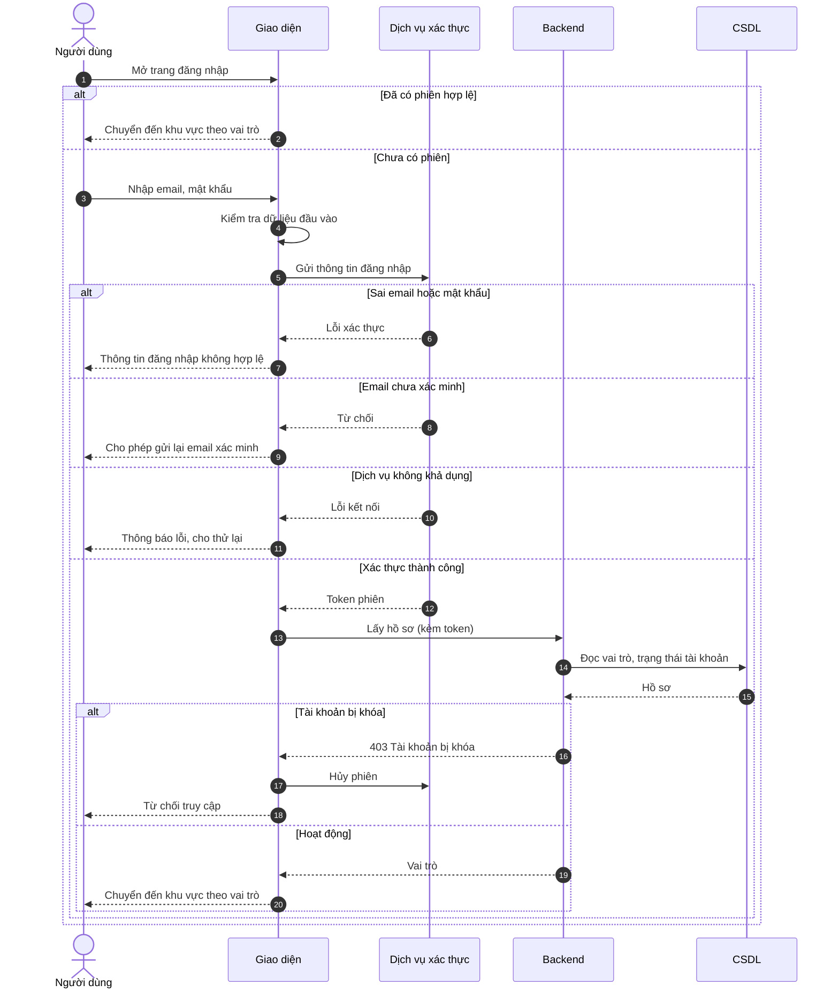
```mermaid
sequenceDiagram
    autonumber
    actor U as Người dùng
    participant UI as Giao diện
    participant AUTH as Dịch vụ xác thực
    participant API as Backend
    participant DB as CSDL
    U->>UI: Mở trang đăng nhập
    alt Đã có phiên hợp lệ
        UI-->>U: Chuyển đến khu vực theo vai trò
    else Chưa có phiên
        U->>UI: Nhập email, mật khẩu
        UI->>UI: Kiểm tra dữ liệu đầu vào
        UI->>AUTH: Gửi thông tin đăng nhập
        alt Sai email hoặc mật khẩu
            AUTH-->>UI: Lỗi xác thực
            UI-->>U: Thông tin đăng nhập không hợp lệ
        else Email chưa xác minh
            AUTH-->>UI: Từ chối
            UI-->>U: Cho phép gửi lại email xác minh
        else Dịch vụ không khả dụng
            AUTH-->>UI: Lỗi kết nối
            UI-->>U: Thông báo lỗi, cho thử lại
        else Xác thực thành công
            AUTH-->>UI: Token phiên
            UI->>API: Lấy hồ sơ (kèm token)
            API->>DB: Đọc vai trò, trạng thái tài khoản
            DB-->>API: Hồ sơ
            alt Tài khoản bị khóa
                API-->>UI: 403 Tài khoản bị khóa
                UI->>AUTH: Hủy phiên
                UI-->>U: Từ chối truy cập
            else Hoạt động
                API-->>UI: Vai trò
                UI-->>U: Chuyển đến khu vực theo vai trò
            end
        end
    end
```

## UC02 – Đăng xuất

### Sơ đồ hoạt động

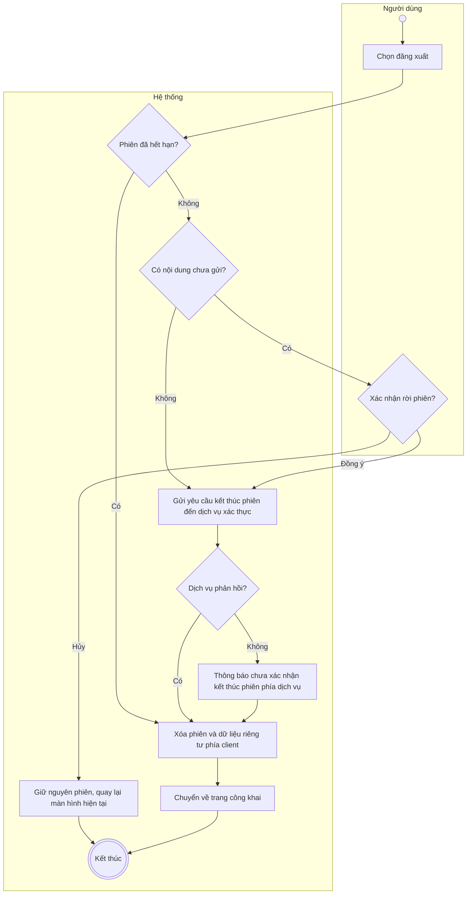
```mermaid
flowchart TD
    subgraph ND["Người dùng"]
        S((" ")) --> A1["Chọn đăng xuất"]
        A2{"Xác nhận rời phiên?"}
    end
    subgraph HT["Hệ thống"]
        B1{"Có nội dung chưa gửi?"}
        B0{"Phiên đã hết hạn?"}
        B2["Gửi yêu cầu kết thúc phiên đến dịch vụ xác thực"]
        B3{"Dịch vụ phản hồi?"}
        B4["Xóa phiên và dữ liệu riêng tư phía client"]
        X1["Thông báo chưa xác nhận kết thúc phiên phía dịch vụ"]
        B5["Chuyển về trang công khai"]
        K["Giữ nguyên phiên, quay lại màn hình hiện tại"]
        E((("Kết thúc")))
    end
    A1 --> B0
    B0 -- Có --> B4
    B0 -- Không --> B1
    B1 -- Có --> A2
    B1 -- Không --> B2
    A2 -- Hủy --> K --> E
    A2 -- Đồng ý --> B2
    B2 --> B3
    B3 -- Có --> B4
    B3 -- Không --> X1 --> B4
    B4 --> B5 --> E
```

### Sơ đồ tuần tự

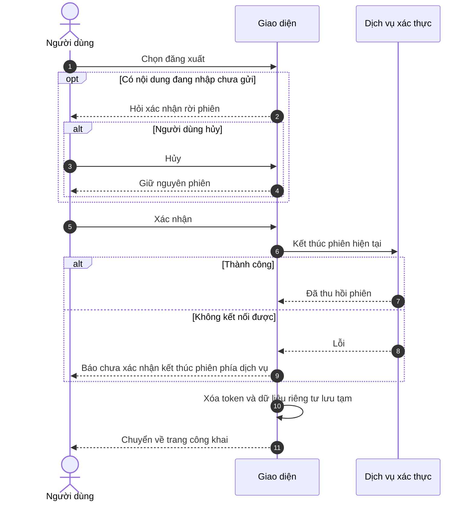
```mermaid
sequenceDiagram
    autonumber
    actor U as Người dùng
    participant UI as Giao diện
    participant AUTH as Dịch vụ xác thực
    U->>UI: Chọn đăng xuất
    opt Có nội dung đang nhập chưa gửi
        UI-->>U: Hỏi xác nhận rời phiên
        alt Người dùng hủy
            U->>UI: Hủy
            UI-->>U: Giữ nguyên phiên
        end
    end
    U->>UI: Xác nhận
    UI->>AUTH: Kết thúc phiên hiện tại
    alt Thành công
        AUTH-->>UI: Đã thu hồi phiên
    else Không kết nối được
        AUTH-->>UI: Lỗi
        UI-->>U: Báo chưa xác nhận kết thúc phiên phía dịch vụ
    end
    UI->>UI: Xóa token và dữ liệu riêng tư lưu tạm
    UI-->>U: Chuyển về trang công khai
```

## UC03 – Xem trang giới thiệu

### Sơ đồ hoạt động

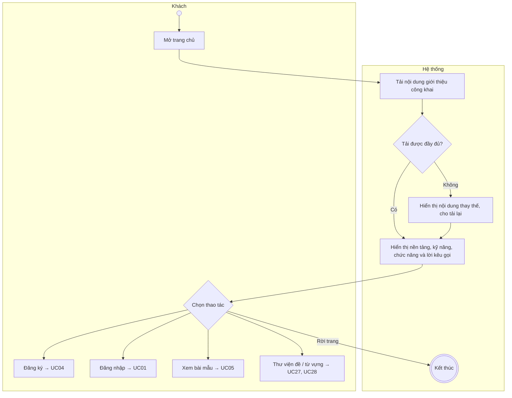
```mermaid
flowchart TD
    subgraph ND["Khách"]
        S((" ")) --> A1["Mở trang chủ"]
        A2{"Chọn thao tác"}
        A3["Đăng ký → UC04"]
        A4["Đăng nhập → UC01"]
        A5["Xem bài mẫu → UC05"]
        A6["Thư viện đề / từ vựng → UC27, UC28"]
    end
    subgraph HT["Hệ thống"]
        B1["Tải nội dung giới thiệu công khai"]
        B2{"Tải được đầy đủ?"}
        B3["Hiển thị nền tảng, kỹ năng, chức năng và lời kêu gọi"]
        X1["Hiển thị nội dung thay thế, cho tải lại"]
        E((("Kết thúc")))
    end
    A1 --> B1 --> B2
    B2 -- Có --> B3
    B2 -- Không --> X1 --> B3
    B3 --> A2
    A2 --> A3 & A4 & A5 & A6
    A2 -- Rời trang --> E
```

### Sơ đồ tuần tự

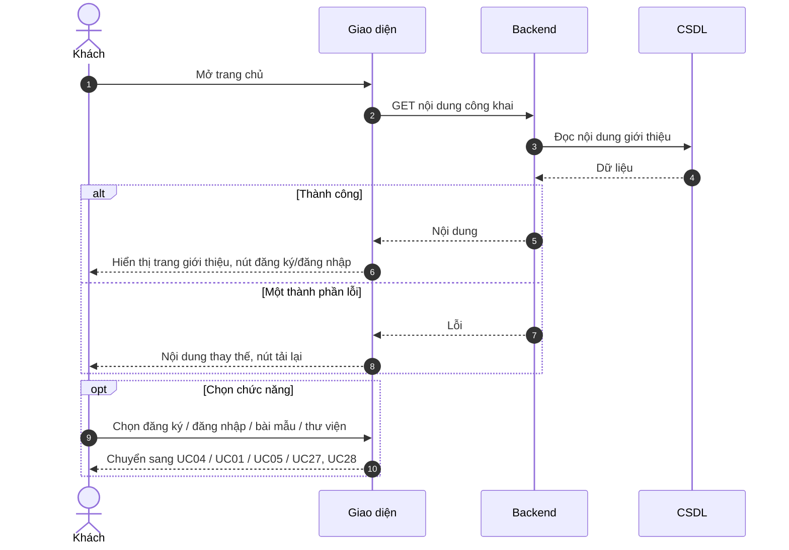
```mermaid
sequenceDiagram
    autonumber
    actor K as Khách
    participant UI as Giao diện
    participant API as Backend
    participant DB as CSDL
    K->>UI: Mở trang chủ
    UI->>API: GET nội dung công khai
    API->>DB: Đọc nội dung giới thiệu
    DB-->>API: Dữ liệu
    alt Thành công
        API-->>UI: Nội dung
        UI-->>K: Hiển thị trang giới thiệu, nút đăng ký/đăng nhập
    else Một thành phần lỗi
        API-->>UI: Lỗi
        UI-->>K: Nội dung thay thế, nút tải lại
    end
    opt Chọn chức năng
        K->>UI: Chọn đăng ký / đăng nhập / bài mẫu / thư viện
        UI-->>K: Chuyển sang UC04 / UC01 / UC05 / UC27, UC28
    end
```

## UC04 – Đăng ký tài khoản

### Sơ đồ hoạt động

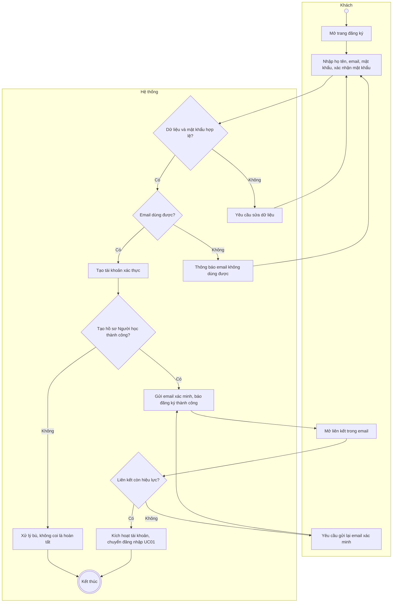
```mermaid
flowchart TD
    subgraph ND["Khách"]
        S((" ")) --> A1["Mở trang đăng ký"]
        A2["Nhập họ tên, email, mật khẩu, xác nhận mật khẩu"]
        A3["Mở liên kết trong email"]
        A4["Yêu cầu gửi lại email xác minh"]
    end
    subgraph HT["Hệ thống"]
        B1{"Dữ liệu và mật khẩu hợp lệ?"}
        B2{"Email dùng được?"}
        B3["Tạo tài khoản xác thực"]
        B4{"Tạo hồ sơ Người học thành công?"}
        B5["Gửi email xác minh, báo đăng ký thành công"]
        B6{"Liên kết còn hiệu lực?"}
        B7["Kích hoạt tài khoản, chuyển đăng nhập UC01"]
        X1["Yêu cầu sửa dữ liệu"]
        X2["Thông báo email không dùng được"]
        X3["Xử lý bù, không coi là hoàn tất"]
        E((("Kết thúc")))
    end
    A1 --> A2 --> B1
    B1 -- Không --> X1 --> A2
    B1 -- Có --> B2
    B2 -- Không --> X2 --> A2
    B2 -- Có --> B3 --> B4
    B4 -- Không --> X3 --> E
    B4 -- Có --> B5 --> A3 --> B6
    B6 -- Có --> B7 --> E
    B6 -- Không --> A4 --> B5
```

### Sơ đồ tuần tự

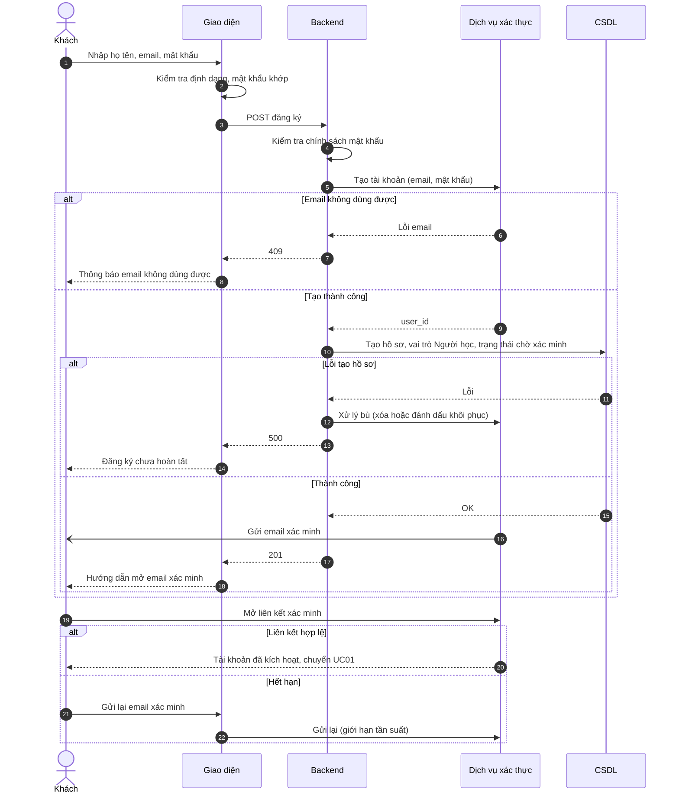
```mermaid
sequenceDiagram
    autonumber
    actor K as Khách
    participant UI as Giao diện
    participant API as Backend
    participant AUTH as Dịch vụ xác thực
    participant DB as CSDL
    K->>UI: Nhập họ tên, email, mật khẩu
    UI->>UI: Kiểm tra định dạng, mật khẩu khớp
    UI->>API: POST đăng ký
    API->>API: Kiểm tra chính sách mật khẩu
    API->>AUTH: Tạo tài khoản (email, mật khẩu)
    alt Email không dùng được
        AUTH-->>API: Lỗi email
        API-->>UI: 409
        UI-->>K: Thông báo email không dùng được
    else Tạo thành công
        AUTH-->>API: user_id
        API->>DB: Tạo hồ sơ, vai trò Người học, trạng thái chờ xác minh
        alt Lỗi tạo hồ sơ
            DB-->>API: Lỗi
            API->>AUTH: Xử lý bù (xóa hoặc đánh dấu khôi phục)
            API-->>UI: 500
            UI-->>K: Đăng ký chưa hoàn tất
        else Thành công
            DB-->>API: OK
            AUTH-)K: Gửi email xác minh
            API-->>UI: 201
            UI-->>K: Hướng dẫn mở email xác minh
        end
    end
    K->>AUTH: Mở liên kết xác minh
    alt Liên kết hợp lệ
        AUTH-->>K: Tài khoản đã kích hoạt, chuyển UC01
    else Hết hạn
        K->>UI: Gửi lại email xác minh
        UI->>AUTH: Gửi lại (giới hạn tần suất)
    end
```

## UC05 – Xem bài mẫu

### Sơ đồ hoạt động

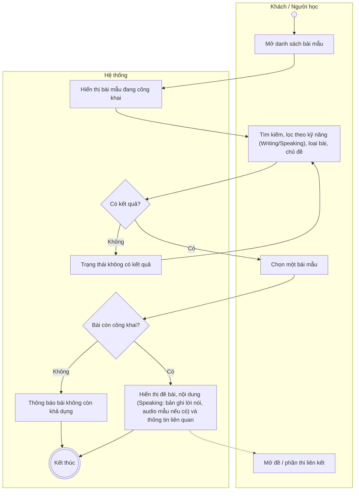
```mermaid
flowchart TD
    subgraph ND["Khách / Người học"]
        S((" ")) --> A1["Mở danh sách bài mẫu"]
        A2["Tìm kiếm, lọc theo kỹ năng (Writing/Speaking), loại bài, chủ đề"]
        A3["Chọn một bài mẫu"]
        A4["Mở đề / phần thi liên kết"]
    end
    subgraph HT["Hệ thống"]
        B1["Hiển thị bài mẫu đang công khai"]
        B2{"Có kết quả?"}
        B3{"Bài còn công khai?"}
        B4["Hiển thị đề bài, nội dung (Speaking: bản ghi lời nói, audio mẫu nếu có) và thông tin liên quan"]
        X1["Trạng thái không có kết quả"]
        X2["Thông báo bài không còn khả dụng"]
        E((("Kết thúc")))
    end
    A1 --> B1 --> A2 --> B2
    B2 -- Không --> X1 --> A2
    B2 -- Có --> A3 --> B3
    B3 -- Không --> X2 --> E
    B3 -- Có --> B4 --> E
    B4 -.-> A4
```

### Sơ đồ tuần tự

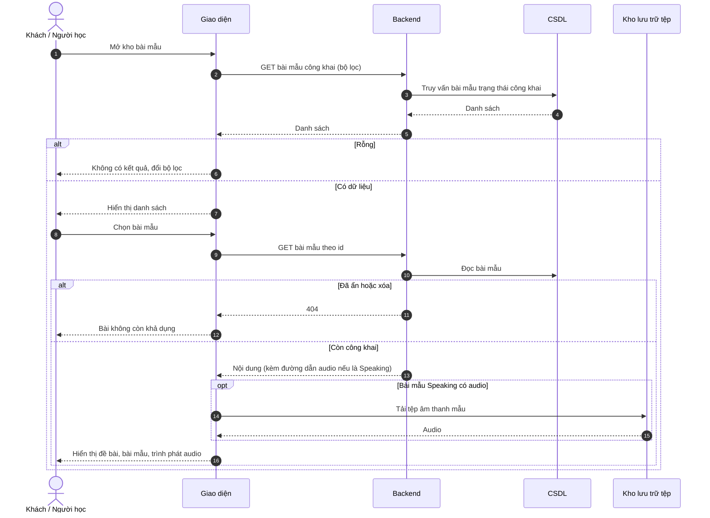
```mermaid
sequenceDiagram
    autonumber
    actor K as Khách / Người học
    participant UI as Giao diện
    participant API as Backend
    participant DB as CSDL
    participant ST as Kho lưu trữ tệp
    K->>UI: Mở kho bài mẫu
    UI->>API: GET bài mẫu công khai (bộ lọc)
    API->>DB: Truy vấn bài mẫu trạng thái công khai
    DB-->>API: Danh sách
    API-->>UI: Danh sách
    alt Rỗng
        UI-->>K: Không có kết quả, đổi bộ lọc
    else Có dữ liệu
        UI-->>K: Hiển thị danh sách
        K->>UI: Chọn bài mẫu
        UI->>API: GET bài mẫu theo id
        API->>DB: Đọc bài mẫu
        alt Đã ẩn hoặc xóa
            API-->>UI: 404
            UI-->>K: Bài không còn khả dụng
        else Còn công khai
            API-->>UI: Nội dung (kèm đường dẫn audio nếu là Speaking)
            opt Bài mẫu Speaking có audio
                UI->>ST: Tải tệp âm thanh mẫu
                ST-->>UI: Audio
            end
            UI-->>K: Hiển thị đề bài, bài mẫu, trình phát audio
        end
    end
```

## UC06 – Quản lý thông tin cá nhân

### Sơ đồ hoạt động

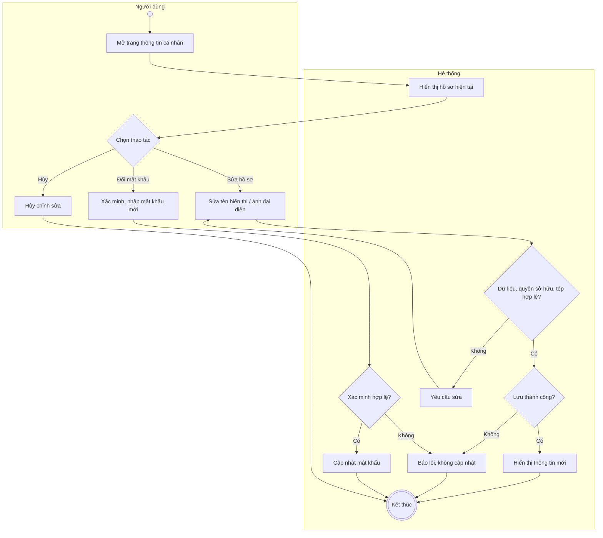
```mermaid
flowchart TD
    subgraph ND["Người dùng"]
        S((" ")) --> A1["Mở trang thông tin cá nhân"]
        A2{"Chọn thao tác"}
        A3["Sửa tên hiển thị / ảnh đại diện"]
        A4["Xác minh, nhập mật khẩu mới"]
        A5["Hủy chỉnh sửa"]
    end
    subgraph HT["Hệ thống"]
        B1["Hiển thị hồ sơ hiện tại"]
        B2{"Dữ liệu, quyền sở hữu, tệp hợp lệ?"}
        B3{"Lưu thành công?"}
        B4["Hiển thị thông tin mới"]
        B5{"Xác minh hợp lệ?"}
        B6["Cập nhật mật khẩu"]
        X1["Yêu cầu sửa"]
        X2["Báo lỗi, không cập nhật"]
        E((("Kết thúc")))
    end
    A1 --> B1 --> A2
    A2 -- Sửa hồ sơ --> A3 --> B2
    B2 -- Không --> X1 --> A3
    B2 -- Có --> B3
    B3 -- Có --> B4 --> E
    B3 -- Không --> X2 --> E
    A2 -- Đổi mật khẩu --> A4 --> B5
    B5 -- Không --> X2
    B5 -- Có --> B6 --> E
    A2 -- Hủy --> A5 --> E
```

### Sơ đồ tuần tự

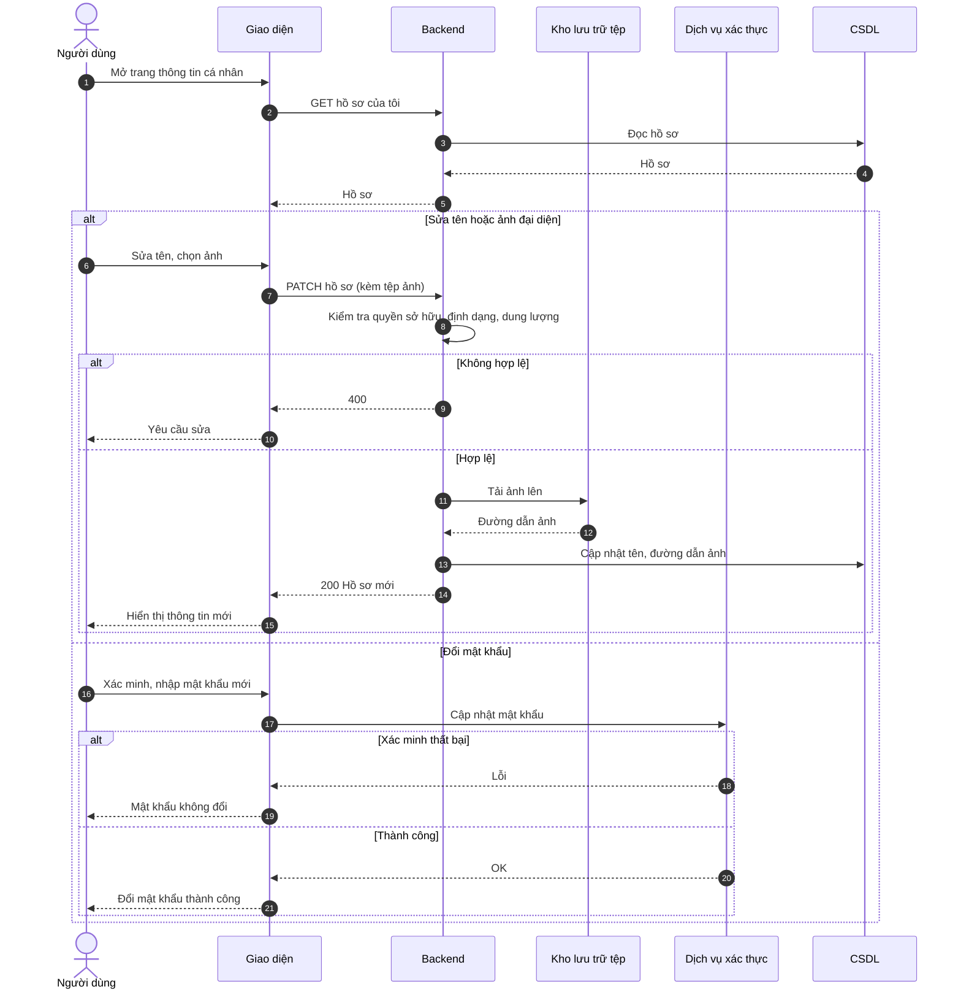
```mermaid
sequenceDiagram
    autonumber
    actor U as Người dùng
    participant UI as Giao diện
    participant API as Backend
    participant ST as Kho lưu trữ tệp
    participant AUTH as Dịch vụ xác thực
    participant DB as CSDL
    U->>UI: Mở trang thông tin cá nhân
    UI->>API: GET hồ sơ của tôi
    API->>DB: Đọc hồ sơ
    DB-->>API: Hồ sơ
    API-->>UI: Hồ sơ
    alt Sửa tên hoặc ảnh đại diện
        U->>UI: Sửa tên, chọn ảnh
        UI->>API: PATCH hồ sơ (kèm tệp ảnh)
        API->>API: Kiểm tra quyền sở hữu, định dạng, dung lượng
        alt Không hợp lệ
            API-->>UI: 400
            UI-->>U: Yêu cầu sửa
        else Hợp lệ
            API->>ST: Tải ảnh lên
            ST-->>API: Đường dẫn ảnh
            API->>DB: Cập nhật tên, đường dẫn ảnh
            API-->>UI: 200 Hồ sơ mới
            UI-->>U: Hiển thị thông tin mới
        end
    else Đổi mật khẩu
        U->>UI: Xác minh, nhập mật khẩu mới
        UI->>AUTH: Cập nhật mật khẩu
        alt Xác minh thất bại
            AUTH-->>UI: Lỗi
            UI-->>U: Mật khẩu không đổi
        else Thành công
            AUTH-->>UI: OK
            UI-->>U: Đổi mật khẩu thành công
        end
    end
```
## UC07 – Làm bài kiểm tra

### Sơ đồ hoạt động

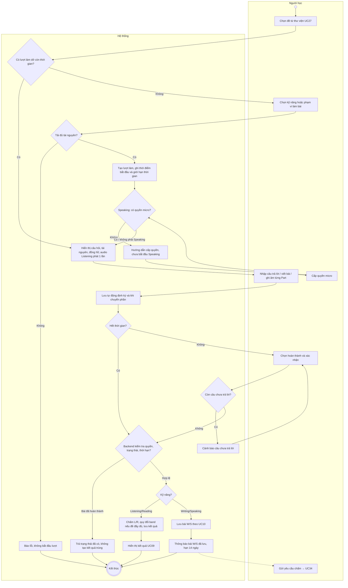
```mermaid
flowchart TD
    subgraph ND["Người học"]
        S((" ")) --> A1["Chọn đề từ thư viện UC27"]
        A2["Chọn kỹ năng hoặc phạm vi làm bài"]
        A3["Nhập câu trả lời / viết bài / ghi âm từng Part"]
        A4["Chọn hoàn thành và xác nhận"]
        A5["Cấp quyền micro"]
        A6["Gửi yêu cầu chấm → UC34"]
    end
    subgraph HT["Hệ thống"]
        B0{"Có lượt làm dở còn thời gian?"}
        B1{"Tải đủ tài nguyên?"}
        B2["Tạo lượt làm, ghi thời điểm bắt đầu và giới hạn thời gian"]
        B3{"Speaking: có quyền micro?"}
        B4["Hiển thị câu hỏi, tài nguyên, đồng hồ; audio Listening phát 1 lần"]
        B5["Lưu tự động định kỳ và khi chuyển phần"]
        B6{"Hết thời gian?"}
        B7{"Còn câu chưa trả lời?"}
        B8["Cảnh báo câu chưa trả lời"]
        B9{"Backend kiểm tra quyền, trạng thái, thời hạn?"}
        B10{"Kỹ năng?"}
        B11["Chấm L/R, quy đổi band nếu đề đầy đủ, lưu kết quả"]
        B12["Lưu bài W/S theo UC10"]
        B13["Hiển thị kết quả UC09"]
        B14["Thông báo bài W/S đã lưu, hạn 14 ngày"]
        X1["Báo lỗi, không bắt đầu lượt"]
        X2["Hướng dẫn cấp quyền, chưa bắt đầu Speaking"]
        X3["Trả trạng thái đã có, không tạo kết quả trùng"]
        E((("Kết thúc")))
    end
    A1 --> B0
    B0 -- Có --> B4
    B0 -- Không --> A2 --> B1
    B1 -- Không --> X1 --> E
    B1 -- Có --> B2 --> B3
    B3 -- Không --> X2 --> A5 --> B3
    B3 -- Có / không phải Speaking --> B4
    B4 --> A3 --> B5 --> B6
    B6 -- Có --> B9
    B6 -- Không --> A4 --> B7
    B7 -- Có --> B8 --> A4
    B7 -- Không --> B9
    B9 -- Bài đã hoàn thành --> X3 --> E
    B9 -- Hợp lệ --> B10
    B10 -- Listening/Reading --> B11 --> B13 --> E
    B10 -- Writing/Speaking --> B12 --> B14 --> E
    B14 -.-> A6
```

### Sơ đồ tuần tự

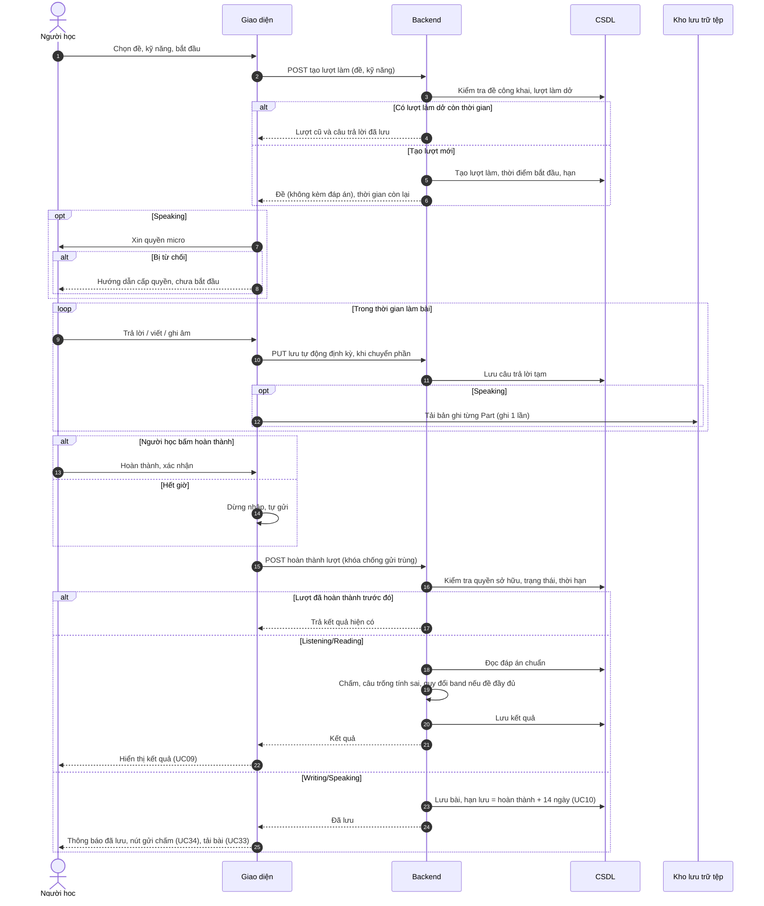
```mermaid
sequenceDiagram
    autonumber
    actor L as Người học
    participant UI as Giao diện
    participant API as Backend
    participant DB as CSDL
    participant ST as Kho lưu trữ tệp
    L->>UI: Chọn đề, kỹ năng, bắt đầu
    UI->>API: POST tạo lượt làm (đề, kỹ năng)
    API->>DB: Kiểm tra đề công khai, lượt làm dở
    alt Có lượt làm dở còn thời gian
        API-->>UI: Lượt cũ và câu trả lời đã lưu
    else Tạo lượt mới
        API->>DB: Tạo lượt làm, thời điểm bắt đầu, hạn
        API-->>UI: Đề (không kèm đáp án), thời gian còn lại
    end
    opt Speaking
        UI->>L: Xin quyền micro
        alt Bị từ chối
            UI-->>L: Hướng dẫn cấp quyền, chưa bắt đầu
        end
    end
    loop Trong thời gian làm bài
        L->>UI: Trả lời / viết / ghi âm
        UI->>API: PUT lưu tự động định kỳ, khi chuyển phần
        API->>DB: Lưu câu trả lời tạm
        opt Speaking
            UI->>ST: Tải bản ghi từng Part (ghi 1 lần)
        end
    end
    alt Người học bấm hoàn thành
        L->>UI: Hoàn thành, xác nhận
    else Hết giờ
        UI->>UI: Dừng nhập, tự gửi
    end
    UI->>API: POST hoàn thành lượt (khóa chống gửi trùng)
    API->>DB: Kiểm tra quyền sở hữu, trạng thái, thời hạn
    alt Lượt đã hoàn thành trước đó
        API-->>UI: Trả kết quả hiện có
    else Listening/Reading
        API->>DB: Đọc đáp án chuẩn
        API->>API: Chấm, câu trống tính sai, quy đổi band nếu đề đầy đủ
        API->>DB: Lưu kết quả
        API-->>UI: Kết quả
        UI-->>L: Hiển thị kết quả (UC09)
    else Writing/Speaking
        API->>DB: Lưu bài, hạn lưu = hoàn thành + 14 ngày (UC10)
        API-->>UI: Đã lưu
        UI-->>L: Thông báo đã lưu, nút gửi chấm (UC34), tải bài (UC33)
    end
```

## UC08 – Luyện tập theo dạng câu hỏi

### Sơ đồ hoạt động

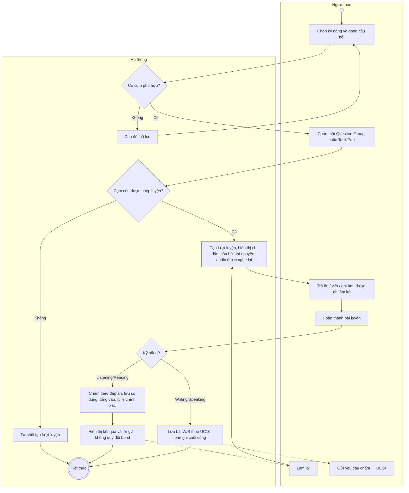
```mermaid
flowchart TD
    subgraph ND["Người học"]
        S((" ")) --> A1["Chọn kỹ năng và dạng câu hỏi"]
        A2["Chọn một Question Group hoặc Task/Part"]
        A3["Trả lời / viết / ghi âm, được ghi âm lại"]
        A4["Hoàn thành bài luyện"]
        A5["Làm lại"]
        A6["Gửi yêu cầu chấm → UC34"]
    end
    subgraph HT["Hệ thống"]
        B1{"Có cụm phù hợp?"}
        B2{"Cụm còn được phép luyện?"}
        B3["Tạo lượt luyện, hiển thị chỉ dẫn, câu hỏi, tài nguyên; audio được nghe lại"]
        B4{"Kỹ năng?"}
        B5["Chấm theo đáp án, lưu số đúng, tổng câu, tỷ lệ chính xác"]
        B6["Hiển thị kết quả và lời giải, không quy đổi band"]
        B7["Lưu bài W/S theo UC10, bản ghi cuối cùng"]
        X1["Cho đổi bộ lọc"]
        X2["Từ chối tạo lượt luyện"]
        E((("Kết thúc")))
    end
    A1 --> B1
    B1 -- Không --> X1 --> A1
    B1 -- Có --> A2 --> B2
    B2 -- Không --> X2 --> E
    B2 -- Có --> B3 --> A3 --> A4 --> B4
    B4 -- Listening/Reading --> B5 --> B6
    B4 -- Writing/Speaking --> B7
    B6 --> E
    B7 --> E
    B6 -.-> A5 --> B3
    B7 -.-> A6
```

### Sơ đồ tuần tự

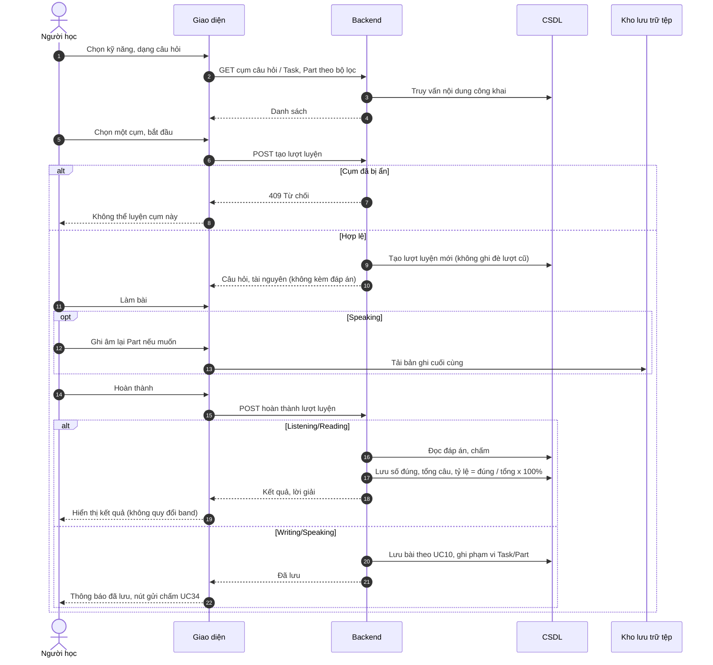
```mermaid
sequenceDiagram
    autonumber
    actor L as Người học
    participant UI as Giao diện
    participant API as Backend
    participant DB as CSDL
    participant ST as Kho lưu trữ tệp
    L->>UI: Chọn kỹ năng, dạng câu hỏi
    UI->>API: GET cụm câu hỏi / Task, Part theo bộ lọc
    API->>DB: Truy vấn nội dung công khai
    API-->>UI: Danh sách
    L->>UI: Chọn một cụm, bắt đầu
    UI->>API: POST tạo lượt luyện
    alt Cụm đã bị ẩn
        API-->>UI: 409 Từ chối
        UI-->>L: Không thể luyện cụm này
    else Hợp lệ
        API->>DB: Tạo lượt luyện mới (không ghi đè lượt cũ)
        API-->>UI: Câu hỏi, tài nguyên (không kèm đáp án)
        L->>UI: Làm bài
        opt Speaking
            L->>UI: Ghi âm lại Part nếu muốn
            UI->>ST: Tải bản ghi cuối cùng
        end
        L->>UI: Hoàn thành
        UI->>API: POST hoàn thành lượt luyện
        alt Listening/Reading
            API->>DB: Đọc đáp án, chấm
            API->>DB: Lưu số đúng, tổng câu, tỷ lệ = đúng / tổng x 100%
            API-->>UI: Kết quả, lời giải
            UI-->>L: Hiển thị kết quả (không quy đổi band)
        else Writing/Speaking
            API->>DB: Lưu bài theo UC10, ghi phạm vi Task/Part
            API-->>UI: Đã lưu
            UI-->>L: Thông báo đã lưu, nút gửi chấm UC34
        end
    end
```

## UC09 – Xem kết quả và lời giải

### Sơ đồ hoạt động

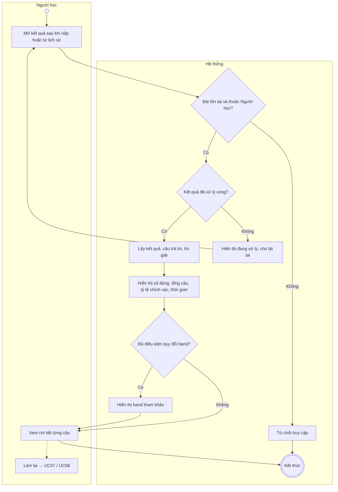
```mermaid
flowchart TD
    subgraph ND["Người học"]
        S((" ")) --> A1["Mở kết quả sau khi nộp hoặc từ lịch sử"]
        A2["Xem chi tiết từng câu"]
        A3["Làm lại → UC07 / UC08"]
    end
    subgraph HT["Hệ thống"]
        B1{"Bài tồn tại và thuộc Người học?"}
        B2{"Kết quả đã xử lý xong?"}
        B3["Lấy kết quả, câu trả lời, lời giải"]
        B4["Hiển thị số đúng, tổng câu, tỷ lệ chính xác, thời gian"]
        B5{"Đủ điều kiện quy đổi band?"}
        B6["Hiển thị band tham khảo"]
        X1["Từ chối truy cập"]
        X2["Hiển thị đang xử lý, cho tải lại"]
        E((("Kết thúc")))
    end
    A1 --> B1
    B1 -- Không --> X1 --> E
    B1 -- Có --> B2
    B2 -- Không --> X2 --> A1
    B2 -- Có --> B3 --> B4 --> B5
    B5 -- Có --> B6 --> A2
    B5 -- Không --> A2
    A2 --> E
    A2 -.-> A3
```

### Sơ đồ tuần tự

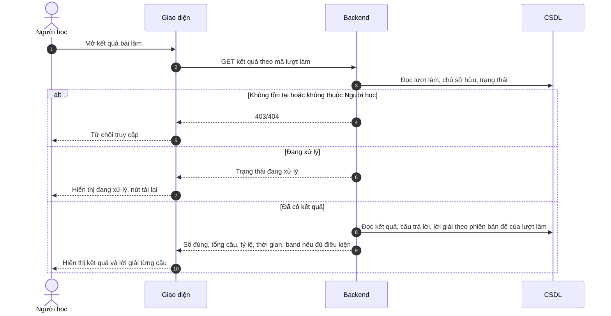
```mermaid
sequenceDiagram
    autonumber
    actor L as Người học
    participant UI as Giao diện
    participant API as Backend
    participant DB as CSDL
    L->>UI: Mở kết quả bài làm
    UI->>API: GET kết quả theo mã lượt làm
    API->>DB: Đọc lượt làm, chủ sở hữu, trạng thái
    alt Không tồn tại hoặc không thuộc Người học
        API-->>UI: 403/404
        UI-->>L: Từ chối truy cập
    else Đang xử lý
        API-->>UI: Trạng thái đang xử lý
        UI-->>L: Hiển thị đang xử lý, nút tải lại
    else Đã có kết quả
        API->>DB: Đọc kết quả, câu trả lời, lời giải theo phiên bản đề của lượt làm
        API-->>UI: Số đúng, tổng câu, tỷ lệ, thời gian, band nếu đủ điều kiện
        UI-->>L: Hiển thị kết quả và lời giải từng câu
    end
```

## UC10 – Hoàn thành và lưu bài Writing/Speaking

### Sơ đồ hoạt động

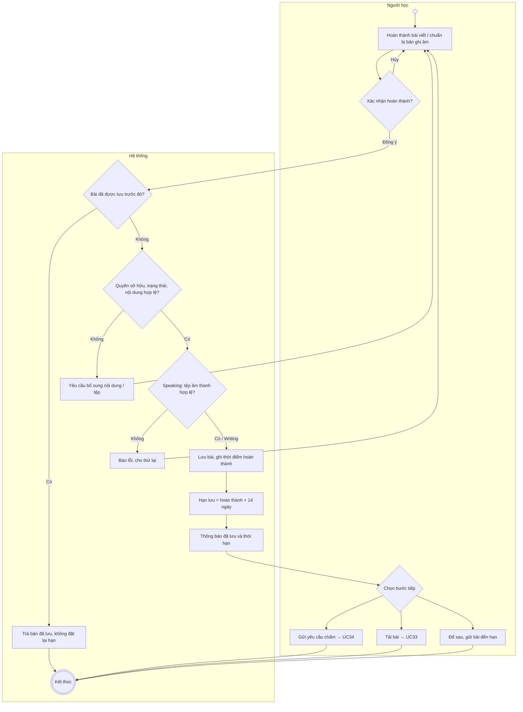
```mermaid
flowchart TD
    subgraph ND["Người học"]
        S((" ")) --> A1["Hoàn thành bài viết / chuẩn bị bản ghi âm"]
        A2{"Xác nhận hoàn thành?"}
        A3{"Chọn bước tiếp"}
        A4["Gửi yêu cầu chấm → UC34"]
        A5["Tải bài → UC33"]
        A6["Để sau, giữ bài đến hạn"]
    end
    subgraph HT["Hệ thống"]
        B1{"Quyền sở hữu, trạng thái, nội dung hợp lệ?"}
        B0{"Bài đã được lưu trước đó?"}
        B2{"Speaking: tệp âm thanh hợp lệ?"}
        B3["Lưu bài, ghi thời điểm hoàn thành"]
        B4["Hạn lưu = hoàn thành + 14 ngày"]
        B5["Thông báo đã lưu và thời hạn"]
        X1["Yêu cầu bổ sung nội dung / tệp"]
        X2["Trả bản đã lưu, không đặt lại hạn"]
        X3["Báo lỗi, cho thử lại"]
        E((("Kết thúc")))
    end
    A1 --> A2
    A2 -- Hủy --> A1
    A2 -- Đồng ý --> B0
    B0 -- Có --> X2 --> E
    B0 -- Không --> B1
    B1 -- Không --> X1 --> A1
    B1 -- Có --> B2
    B2 -- Không --> X3 --> A1
    B2 -- Có / Writing --> B3 --> B4 --> B5 --> A3
    A3 --> A4 & A5 & A6
    A4 --> E
    A5 --> E
    A6 --> E
```

### Sơ đồ tuần tự

```mermaid
sequenceDiagram
    autonumber
    actor L as Người học
    participant UI as Giao diện
    participant API as Backend
    participant ST as Kho lưu trữ tệp
    participant DB as CSDL
    L->>UI: Chọn hoàn thành, xác nhận
    opt Speaking
        UI->>ST: Tải tệp ghi âm
        ST-->>UI: Đường dẫn tệp
    end
    UI->>API: POST hoàn thành bài W/S (nội dung / đường dẫn tệp)
    API->>DB: Kiểm tra quyền sở hữu, trạng thái lượt làm
    alt Đã hoàn thành trước đó
        API-->>UI: Bản đã lưu, hạn cũ
    else Bài trống, thiếu tệp hoặc sai định dạng
        API-->>UI: 400
        UI-->>L: Yêu cầu bổ sung
    else Hợp lệ
        API->>DB: Lưu bài, thời điểm hoàn thành, hạn lưu = +14 ngày
        Note over API,DB: Không tạo yêu cầu chấm, không dùng lượt
        API-->>UI: Đã lưu, hạn nội dung
        UI-->>L: Thông báo, nút gửi chấm (UC34) và tải bài (UC33)
    end
```

## UC11 – Xem nhận xét của Giáo viên

### Sơ đồ hoạt động

```mermaid
flowchart TD
    subgraph ND["Người học"]
        S((" ")) --> A1["Mở bài từ lịch sử"]
        A2["Đọc bài / nghe lại bản ghi"]
        A3["Tải bài → UC33"]
    end
    subgraph HT["Hệ thống"]
        B1{"Bài thuộc Người học?"}
        B2{"Đã có kết quả công bố?"}
        B3["Hiển thị điểm từng tiêu chí, điểm tổng hợp, nhận xét, thời điểm chấm"]
        B4{"Nội dung còn hiệu lực?"}
        B5["Cho phép mở nội dung bài"]
        B6["Chỉ hiển thị điểm và nhận xét"]
        X1["Từ chối truy cập"]
        X2["Hiển thị trạng thái: chưa gửi, chờ phân công, chờ chấm, đã hủy"]
        E((("Kết thúc")))
    end
    A1 --> B1
    B1 -- Không --> X1 --> E
    B1 -- Có --> B2
    B2 -- Không --> X2 --> E
    B2 -- Có --> B3 --> B4
    B4 -- Có --> B5 --> A2 --> E
    B4 -- Không --> B6 --> E
    B5 -.-> A3
```

### Sơ đồ tuần tự

```mermaid
sequenceDiagram
    autonumber
    actor L as Người học
    participant UI as Giao diện
    participant API as Backend
    participant DB as CSDL
    participant ST as Kho lưu trữ tệp
    L->>UI: Mở bài W/S từ lịch sử
    UI->>API: GET kết quả chấm của bài
    API->>DB: Kiểm tra chủ sở hữu, đọc yêu cầu và kết quả
    alt Không thuộc Người học
        API-->>UI: 403
        UI-->>L: Từ chối truy cập
    else Chưa có kết quả
        API-->>UI: Trạng thái yêu cầu
        UI-->>L: Hiển thị trạng thái, không có điểm
    else Đã công bố
        API->>DB: Đánh dấu đã xem (xóa chấm đỏ)
        alt Nội dung còn hạn
            API->>ST: Tạo đường dẫn đọc tạm thời
            API-->>UI: Điểm, nhận xét, đường dẫn nội dung
            UI-->>L: Hiển thị kết quả và bài làm
        else Nội dung hết hạn
            API-->>UI: Điểm, nhận xét
            UI-->>L: Hiển thị kết quả, báo nội dung đã hết hạn
        end
    end
```

## UC12 – Ôn tập từ vựng bằng flashcard

### Sơ đồ hoạt động

```mermaid
flowchart TD
    subgraph ND["Người học"]
        S((" ")) --> A1["Chọn tập từ: chủ đề / yêu thích / nhãn"]
        A2["Xem từ, lật thẻ xem nghĩa và ví dụ"]
        A3["Tự đánh giá mức độ nhớ"]
        A4{"Tiếp tục?"}
    end
    subgraph HT["Hệ thống"]
        B1{"Tập từ có thẻ?"}
        B2["Tạo phiên ôn, hiển thị thẻ đầu tiên"]
        B3["Ghi nhận tương tác, chuyển thẻ"]
        B4{"Hết tập hoặc đạt số thẻ tối thiểu?"}
        B5["Lưu phiên, tính là phiên học hợp lệ"]
        B6["Lưu phần đã ôn, không tính hoàn thành"]
        B7["Hiển thị số từ đã ôn và kết quả tự đánh giá"]
        X1["Hướng dẫn chọn tập khác"]
        E((("Kết thúc")))
    end
    A1 --> B1
    B1 -- Không --> X1 --> A1
    B1 -- Có --> B2 --> A2 --> A3 --> B3 --> A4
    A4 -- Có --> A2
    A4 -- Kết thúc --> B4
    B4 -- Có --> B5 --> B7
    B4 -- Không --> B6 --> B7
    B7 --> E
```

### Sơ đồ tuần tự

```mermaid
sequenceDiagram
    autonumber
    actor L as Người học
    participant UI as Giao diện
    participant API as Backend
    participant DB as CSDL
    L->>UI: Chọn tập từ
    UI->>API: POST tạo phiên flashcard
    API->>DB: Lấy danh sách thẻ đang cung cấp
    alt Tập rỗng
        API-->>UI: Rỗng
        UI-->>L: Hướng dẫn chọn tập khác
    else Có thẻ
        API->>DB: Tạo phiên ôn
        API-->>UI: Phiên, danh sách thẻ
        loop Mỗi thẻ
            L->>UI: Lật thẻ, tự đánh giá
            UI->>API: Ghi nhận tương tác
            API->>DB: Lưu (không đếm trùng cùng thẻ)
        end
        L->>UI: Kết thúc phiên
        UI->>API: POST hoàn thành phiên
        API->>DB: Đếm số thẻ khác nhau, đọc tham số tối thiểu (mặc định 10)
        alt Hết tập hoặc đủ số thẻ tối thiểu
            API->>DB: Đánh dấu phiên hợp lệ, cập nhật streak, mục tiêu
        else Chưa đủ
            API->>DB: Lưu phần đã ôn
        end
        API-->>UI: Kết quả phiên
        UI-->>L: Số từ đã ôn, kết quả tự đánh giá
    end
```
## UC13 – Xem lịch sử và thống kê

### Sơ đồ hoạt động

```mermaid
flowchart TD
    subgraph ND["Người học"]
        S((" ")) --> A1["Mở trang tiến độ"]
        A2["Lọc theo thời gian, kỹ năng, loại hoạt động"]
        A3{"Chọn thao tác trên một bài"}
        A4["Xem kết quả → UC09 / UC11"]
        A5["Gửi yêu cầu chấm → UC34"]
        A6["Tải bài → UC33"]
        A7["Thiết lập mục tiêu → UC31"]
    end
    subgraph HT["Hệ thống"]
        B1["Lấy lịch sử bài làm và phiên ôn từ vựng"]
        B2{"Có dữ liệu?"}
        B3["Hiển thị kết quả theo kỹ năng, biểu đồ, mức hoàn thành mục tiêu"]
        B4["Hiển thị trạng thái yêu cầu chấm, hạn nội dung, lượt miễn phí, bonus; chấm đỏ cho yêu cầu vừa hủy / vừa có kết quả"]
        B5["Hiển thị streak, Daily Motivation UC32"]
        B6{"Khoảng thời gian hợp lệ?"}
        B7["Cập nhật danh sách và biểu đồ"]
        X1["Trạng thái bắt đầu học, liên kết UC31"]
        X2["Yêu cầu chọn lại"]
        E((("Kết thúc")))
    end
    A1 --> B1 --> B2
    B2 -- Không --> X1 --> E
    B2 -- Có --> B3 --> B4 --> B5 --> A2 --> B6
    B6 -- Không --> X2 --> A2
    B6 -- Có --> B7 --> A3
    A3 --> A4 & A5 & A6 & A7
    A3 -- Không chọn --> E
```

### Sơ đồ tuần tự

```mermaid
sequenceDiagram
    autonumber
    actor L as Người học
    participant UI as Giao diện
    participant API as Backend
    participant DB as CSDL
    L->>UI: Mở trang tiến độ
    par Lịch sử và thống kê
        UI->>API: GET lịch sử, thống kê (bộ lọc)
        API->>DB: Tổng hợp dữ liệu của Người học hiện tại
        DB-->>API: Bài làm, phiên ôn, band theo kỹ năng, tỷ lệ chính xác
        API-->>UI: Dữ liệu thống kê
    and Hỗ trợ chấm
        UI->>API: GET yêu cầu chấm, lượt còn lại
        API->>DB: Đọc yêu cầu, hạn nội dung, lượt miễn phí, bonus, cờ chưa xem
        API-->>UI: Trạng thái, số lượt, chấm đỏ
    and Động lực
        UI->>API: GET streak, mục tiêu, Daily Motivation
        API-->>UI: Streak, mục tiêu, thông điệp
    end
    UI-->>L: Hiển thị biểu đồ, lịch sử, trạng thái, chấm đỏ
    opt Đổi bộ lọc
        L->>UI: Chọn thời gian, kỹ năng
        UI->>API: GET thống kê theo bộ lọc
        alt Khoảng thời gian không hợp lệ
            API-->>UI: 400
            UI-->>L: Yêu cầu chọn lại
        else Hợp lệ
            API-->>UI: Dữ liệu mới
            UI-->>L: Cập nhật biểu đồ
        end
    end
    opt Mở chi tiết bài có chấm đỏ
        L->>UI: Mở bài
        UI->>API: Đánh dấu đã xem
        API->>DB: Xóa cờ chưa xem
    end
```

## UC14 – Tùy chỉnh giao diện

### Sơ đồ hoạt động

```mermaid
flowchart TD
    subgraph ND["Người dùng"]
        S((" ")) --> A1["Mở tùy chọn giao diện"]
        A2["Chọn chế độ sáng hoặc tối"]
    end
    subgraph HT["Hệ thống"]
        B0["Đọc tùy chọn đã lưu, nếu không có dùng mặc định"]
        B1["Áp dụng chế độ cho giao diện hiện tại"]
        B2{"Lưu được trên trình duyệt?"}
        B3["Lưu tùy chọn cho lần sau"]
        X1["Chỉ áp dụng trong phiên hiện tại"]
        E((("Kết thúc")))
    end
    A1 --> B0 --> A2 --> B1 --> B2
    B2 -- Có --> B3 --> E
    B2 -- Không --> X1 --> E
```

### Sơ đồ tuần tự

```mermaid
sequenceDiagram
    autonumber
    actor U as Người dùng
    participant UI as Giao diện
    participant LS as Bộ nhớ trình duyệt
    UI->>LS: Đọc chế độ đã lưu
    LS-->>UI: Chế độ hoặc rỗng (dùng mặc định)
    U->>UI: Chọn sáng / tối
    UI->>UI: Áp dụng chế độ, giữ nguyên nội dung đang nhập
    UI->>LS: Lưu chế độ
    alt Lưu thất bại
        LS-->>UI: Lỗi
        UI-->>U: Áp dụng trong phiên hiện tại
    else Thành công
        LS-->>UI: OK
        UI-->>U: Giao diện đã đổi
    end
```

## UC15 – Xem hàng đợi bài chờ chấm

### Sơ đồ hoạt động

```mermaid
flowchart TD
    subgraph ND["Giáo viên"]
        S((" ")) --> A1["Mở khu vực chấm bài"]
        A2["Lọc theo kỹ năng, sắp xếp theo thời gian"]
        A3["Chọn một bài → UC16"]
    end
    subgraph HT["Hệ thống"]
        B1["Xác định danh tính, quyền Giáo viên"]
        B2["Truy vấn bài được phân công cho Giáo viên"]
        B3{"Có bài?"}
        B4["Hiển thị kỹ năng, người gửi, thời điểm tiếp nhận, phân công, thời gian chờ, bài có nháp"]
        B5{"Bài còn được phân công cho mình?"}
        X1["Hàng đợi rỗng"]
        X2["Thông báo bài đã đổi trạng thái, làm mới danh sách"]
        E((("Kết thúc")))
    end
    A1 --> B1 --> B2 --> B3
    B3 -- Không --> X1 --> E
    B3 -- Có --> B4 --> A2 --> A3 --> B5
    B5 -- Không --> X2 --> B4
    B5 -- Có --> E
```

### Sơ đồ tuần tự

```mermaid
sequenceDiagram
    autonumber
    actor GV as Giáo viên
    participant UI as Giao diện
    participant API as Backend
    participant DB as CSDL
    GV->>UI: Mở khu vực chấm bài
    UI->>API: GET hàng đợi của tôi (bộ lọc)
    API->>API: Xác thực token, kiểm tra vai trò Giáo viên
    API->>DB: Truy vấn yêu cầu đã phân công cho Giáo viên, chưa có kết quả
    DB-->>API: Danh sách, cờ có nháp
    alt Rỗng
        API-->>UI: []
        UI-->>GV: Hàng đợi rỗng
    else Có bài
        API-->>UI: Danh sách
        UI-->>GV: Hiển thị bài chờ chấm
        GV->>UI: Chọn một bài
        UI->>API: GET chi tiết yêu cầu
        alt Bài đã đổi trạng thái hoặc phân công
            API-->>UI: 409
            UI-->>GV: Thông báo, làm mới danh sách
        else Hợp lệ
            API-->>UI: Chi tiết
            UI-->>GV: Mở màn hình chấm (UC16)
        end
    end
```

## UC16 – Chấm bài Writing/Speaking

### Sơ đồ hoạt động

```mermaid
flowchart TD
    subgraph ND["Giáo viên"]
        S((" ")) --> A1["Mở bài từ hàng đợi"]
        A2["Đọc bài / nghe bản ghi"]
        A3["Nhập điểm và nhận xét từng tiêu chí"]
        A4{"Chọn thao tác"}
        A5["Hủy nhập"]
    end
    subgraph HT["Hệ thống"]
        B1{"Còn quyền, còn phân công, yêu cầu chưa có kết quả?"}
        B2["Hiển thị đề, bài làm, bộ tiêu chí; nạp bản nháp nếu có"]
        B3{"Đọc / phát được nội dung?"}
        B4{"Dữ liệu chấm hợp lệ?"}
        B5["Tính điểm tổng hợp"]
        B6["Lưu nháp, không đổi trạng thái"]
        B7{"Kiểm tra lại quyền và trạng thái khi công bố"}
        B8["Lưu kết quả, thời điểm công bố; yêu cầu → đã có kết quả"]
        B9["Hạn nội dung = công bố + 14 ngày; giảm số bài chưa chấm"]
        B10["Đánh dấu chưa xem cho Người học; xét phân công bài tiếp theo"]
        B11{"GV đang chờ thu hồi quyền và hết bài?"}
        B12["Hoàn tất thu hồi quyền theo UC19"]
        X1["Từ chối, báo không còn quyền / đã có kết quả"]
        X2["Không cho hoàn tất chấm"]
        X3["Yêu cầu sửa điểm / nhận xét"]
        X4["Yêu cầu đã bị hủy: từ chối công bố"]
        E((("Kết thúc")))
    end
    A1 --> B1
    B1 -- Không --> X1 --> E
    B1 -- Có --> B2 --> B3
    B3 -- Không --> X2 --> E
    B3 -- Có --> A2 --> A3 --> A4
    A4 -- Lưu nháp --> B6 --> E
    A4 -- Hủy --> A5 --> E
    A4 -- Công bố --> B4
    B4 -- Không --> X3 --> A3
    B4 -- Có --> B5 --> B7
    B7 -- Đã bị hủy --> X4 --> E
    B7 -- Hợp lệ --> B8 --> B9 --> B10 --> B11
    B11 -- Có --> B12 --> E
    B11 -- Không --> E
```

### Sơ đồ tuần tự

```mermaid
sequenceDiagram
    autonumber
    actor GV as Giáo viên
    participant UI as Giao diện
    participant API as Backend
    participant DB as CSDL
    participant ST as Kho lưu trữ tệp
    GV->>UI: Mở bài từ hàng đợi
    UI->>API: GET bài chấm theo mã yêu cầu
    API->>DB: Kiểm tra quyền chấm kỹ năng, quan hệ phân công, trạng thái
    alt Không hợp lệ
        API-->>UI: 403/409
        UI-->>GV: Từ chối
    else Hợp lệ
        API->>DB: Đọc đề, bộ tiêu chí, bản nháp
        API->>ST: Tạo đường dẫn đọc tạm thời
        API-->>UI: Đề, bài làm, tiêu chí, nháp
        GV->>UI: Đọc / nghe, nhập điểm và nhận xét
        opt Lưu nháp
            UI->>API: PUT nháp
            API->>DB: Lưu nháp (không đổi trạng thái)
        end
        GV->>UI: Xác nhận công bố
        UI->>API: POST công bố kết quả
        API->>API: Kiểm tra miền điểm, tính điểm tổng hợp
        API->>DB: Giao dịch: khóa yêu cầu, kiểm tra lại quyền và trạng thái
        alt Đã bị Quản lý hủy hoặc đã có kết quả
            API-->>UI: 409
            UI-->>GV: Không thể công bố, cập nhật trạng thái
        else Hợp lệ
            API->>DB: Lưu kết quả, thời điểm công bố, trạng thái đã có kết quả
            API->>DB: Hạn nội dung = công bố + 14 ngày, giảm số bài chưa chấm
            API->>DB: Đặt cờ chưa xem cho Người học
            API-->>UI: 200
            UI-->>GV: Công bố thành công
            API-)API: Xét phân công bài tiếp theo (3.4.5)
            opt Giáo viên đang chờ thu hồi quyền và đã hết bài
                API->>DB: Hoàn tất thu hồi quyền (UC19)
            end
        end
    end
```

## UC17 – Xem lịch sử bài đã chấm

### Sơ đồ hoạt động

```mermaid
flowchart TD
    subgraph ND["Giáo viên"]
        S((" ")) --> A1["Mở lịch sử chấm bài"]
        A2["Chọn bộ lọc / khoảng thời gian"]
        A3["Mở chi tiết một kết quả"]
    end
    subgraph HT["Hệ thống"]
        B1["Truy vấn kết quả do Giáo viên chấm, trong phạm vi được xem"]
        B2{"Có kết quả?"}
        B3["Hiển thị danh sách, kỹ năng, điểm, ngày chấm, khối lượng"]
        B4{"Còn quyền xem chi tiết?"}
        B5["Hiển thị điểm, nhận xét đã gửi"]
        B6{"Nội dung còn hiệu lực?"}
        B7["Cho xem lại nội dung bài"]
        X1["Danh sách rỗng"]
        X2["Từ chối truy cập"]
        X3["Chỉ hiển thị thông tin kết quả"]
        E((("Kết thúc")))
    end
    A1 --> B1 --> B2
    B2 -- Không --> X1 --> A2
    B2 -- Có --> B3 --> A2 --> B1
    B3 --> A3 --> B4
    B4 -- Không --> X2 --> E
    B4 -- Có --> B5 --> B6
    B6 -- Có --> B7 --> E
    B6 -- Không --> X3 --> E
```

### Sơ đồ tuần tự

```mermaid
sequenceDiagram
    autonumber
    actor GV as Giáo viên
    participant UI as Giao diện
    participant API as Backend
    participant DB as CSDL
    GV->>UI: Mở lịch sử chấm
    UI->>API: GET kết quả đã chấm (bộ lọc, thời gian)
    API->>DB: Truy vấn kết quả có người chấm = Giáo viên hiện tại
    alt Truy vấn lỗi hoặc khoảng thời gian sai
        API-->>UI: 400/500
        UI-->>GV: Thông báo lỗi
    else Thành công
        API-->>UI: Danh sách, tổng số bài
        UI-->>GV: Hiển thị lịch sử, khối lượng công việc
    end
    GV->>UI: Mở chi tiết
    UI->>API: GET chi tiết kết quả
    API->>DB: Kiểm tra quyền, hạn nội dung
    alt Không còn quyền
        API-->>UI: 403
    else Nội dung còn hạn
        API-->>UI: Điểm, nhận xét, đường dẫn nội dung
    else Hết hạn
        API-->>UI: Điểm, nhận xét
    end
    UI-->>GV: Hiển thị chi tiết
```

## UC18 – Theo dõi hoạt động hỗ trợ chấm bài

### Sơ đồ hoạt động

```mermaid
flowchart TD
    subgraph ND["Quản lý"]
        S((" ")) --> A1["Mở trang theo dõi hỗ trợ chấm"]
        A2["Lọc theo kỹ năng, Giáo viên, trạng thái, nguyên nhân hủy, thời gian"]
        A3["Chọn một yêu cầu"]
        A4["Chuyển UC19 để đổi quyền, giới hạn, xử lý Giáo viên"]
    end
    subgraph HT["Hệ thống"]
        B1["Hiển thị yêu cầu chờ phân công, thời gian còn lại trước 72 giờ"]
        B2["Hiển thị bài chờ chấm theo Giáo viên, giới hạn, trạng thái nhận bài"]
        B3["Hiển thị yêu cầu đã hủy, nguyên nhân, trạng thái hoàn bonus"]
        B4{"Bộ lọc hợp lệ?"}
        B5["Cập nhật danh sách"]
        B6["Hiển thị các mốc tiếp nhận, phân công, công bố / hủy và lượt liên quan"]
        X1["Yêu cầu điều chỉnh bộ lọc"]
        E((("Kết thúc")))
    end
    A1 --> B1 --> B2 --> B3 --> A2 --> B4
    B4 -- Không --> X1 --> A2
    B4 -- Có --> B5 --> A3 --> B6 --> E
    B6 -.-> A4
```

### Sơ đồ tuần tự

```mermaid
sequenceDiagram
    autonumber
    actor QL as Quản lý
    participant UI as Giao diện
    participant API as Backend
    participant DB as CSDL
    QL->>UI: Mở trang theo dõi hỗ trợ chấm
    UI->>API: GET tổng quan hỗ trợ chấm (bộ lọc)
    API->>API: Kiểm tra quyền giám sát
    API->>DB: Yêu cầu chờ phân công và hạn 72 giờ
    API->>DB: Tải công việc từng Giáo viên, giới hạn, trạng thái nhận bài
    API->>DB: Yêu cầu đã hủy, nguyên nhân, giao dịch hoàn bonus
    DB-->>API: Dữ liệu
    API-->>UI: Dữ liệu tổng hợp (không kèm nội dung bài)
    UI-->>QL: Hiển thị bảng theo dõi, cảnh báo chờ lâu
    QL->>UI: Chọn một yêu cầu
    UI->>API: GET dòng thời gian yêu cầu
    API->>DB: Đọc các mốc và lượt liên quan
    API-->>UI: Dòng thời gian
    UI-->>QL: Hiển thị chi tiết
    Note over UI,API: Chỉ xem, không phân công, hủy hay cấp bonus tại đây
```

## UC19 – Quản lý người dùng

### Sơ đồ hoạt động

```mermaid
flowchart TD
    subgraph QL["Quản lý"]
        S((" ")) --> A1["Mở danh sách người dùng"]
        A2["Tìm kiếm, lọc, chọn tài khoản"]
        A3{"Chọn thao tác"}
        A4["Nhập thông tin, vai trò / sửa quyền chấm, giới hạn"]
        A6["Khóa / mở / xóa tài khoản"]
        A7["Thu hồi quyền chấm"]
        A8{"Giáo viên chấm nốt được?"}
        A10["Xem bài bị ảnh hưởng, nhập lý do"]
        A9{"Xác nhận?"}
    end
    subgraph HT["Hệ thống"]
        B1["Hiển thị thông tin chi tiết"]
        B2{"Dữ liệu và ràng buộc hợp lệ?"}
        B9{"Loại tài khoản bị khóa/xóa?"}
        B5{"Giáo viên còn bài chưa chấm?"}
        B3["Lưu thay đổi, ghi nhật ký"]
        B4["Tài khoản GV / QL mới: gửi email mời đặt mật khẩu"]
        B6["Ngừng phân công mới; thu hồi khi bài cuối được công bố"]
        B7["Thu hồi quyền ngay"]
        X2["Loại yêu cầu đã công bố khỏi danh sách hủy"]
        B8["Hủy yêu cầu chưa có kết quả, hoàn 1 bonus mỗi yêu cầu, thu hồi quyền, báo lý do ở UC13"]
        B10["Người học bị khóa: giữ yêu cầu chấm / bị xóa: hủy yêu cầu, không hoàn bonus"]
        X1["Từ chối: email trùng, dữ liệu sai, hoặc không còn Quản lý hoạt động"]
        E((("Kết thúc")))
    end
    A1 --> A2 --> B1 --> A3
    A3 -- Tạo / sửa --> A4 --> B2
    A3 -- Khóa / xóa --> A6 --> B2
    A3 -- Thu hồi --> A7 --> B2
    B2 -- Không --> X1 --> A3
    B2 -- Có --> A9
    A9 -- Hủy --> E
    A9 -- Đồng ý, tạo / sửa --> B3
    A9 -- Đồng ý, khóa / xóa --> B9
    A9 -- Đồng ý, thu hồi --> B5
    B9 -- Người học --> B10 --> B3
    B9 -- Giáo viên --> B5
    B5 -- Không --> B7 --> B3
    B5 -- Có --> A8
    A8 -- Có --> B6 --> B3
    A8 -- Không --> A10 --> X2 --> B8 --> B3
    B3 --> B4 --> E
```

### Sơ đồ tuần tự

```mermaid
sequenceDiagram
    autonumber
    actor QL as Quản lý
    participant UI as Giao diện
    participant API as Backend
    participant AUTH as Dịch vụ xác thực
    participant DB as CSDL
    QL->>UI: Mở danh sách, chọn tài khoản
    UI->>API: GET người dùng
    API->>DB: Truy vấn
    API-->>UI: Thông tin (không có mật khẩu)
    alt Tạo tài khoản Giáo viên / Quản lý
        QL->>UI: Nhập thông tin, vai trò
        UI->>API: POST tạo người dùng
        API->>AUTH: Tạo tài khoản, gửi email mời đặt mật khẩu
        alt Email trùng
            AUTH-->>API: Lỗi
            API-->>UI: 409
        else Thành công
            API->>DB: Tạo hồ sơ, vai trò, ghi nhật ký
            API-->>UI: 201
        end
    else Sửa quyền chấm / giới hạn nhận bài
        QL->>UI: Sửa, xác nhận
        UI->>API: PATCH quyền, giới hạn
        API->>DB: Lưu, ghi nhật ký
        API-)API: Xét lại phân công
        API-->>UI: 200
    else Thu hồi quyền / khóa Giáo viên còn bài
        QL->>UI: Chọn thu hồi
        UI->>API: POST thu hồi quyền
        API->>DB: Đếm bài chưa chấm trong phạm vi quyền
        alt Không còn bài
            API->>DB: Thu hồi ngay
        else Còn bài, chấm nốt
            API->>DB: Ngừng nhận bài mới
            Note over API,DB: Thu hồi khi bài cuối được công bố (UC16)
        else Giáo viên không thể hoàn thành
            QL->>UI: Xem bài bị ảnh hưởng, nhập lý do, xác nhận
            UI->>API: POST hủy do không thể hoàn thành
            API->>DB: Giao dịch: bỏ yêu cầu đã công bố, hủy phần còn lại
            API->>DB: Hoàn 1 bonus mỗi yêu cầu, đặt cờ chưa xem, thu hồi quyền, ghi nhật ký
        end
        API-->>UI: Kết quả xử lý
    else Khóa / xóa Người học
        QL->>UI: Chọn khóa hoặc xóa
        UI->>API: PATCH trạng thái / DELETE
        API->>AUTH: Vô hiệu hóa đăng nhập
        alt Khóa
            API->>DB: Đổi trạng thái, giữ yêu cầu chấm
        else Xóa
            API->>DB: Hủy yêu cầu chưa có kết quả, không hoàn bonus, xóa mềm
        end
        API-->>UI: 200
    end
    UI-->>QL: Hiển thị kết quả
```
## UC20 – Quản lý Bộ đề và Đề thi

### Sơ đồ hoạt động

```mermaid
flowchart TD
    subgraph QL["Quản lý"]
        S((" ")) --> A1["Mở khu vực đề thi"]
        A2{"Chọn thao tác"}
        A3["Nhập thông tin, cấu trúc kỹ năng → phần → cụm → câu hỏi"]
        A4["Nhập đáp án / chọn bộ tiêu chí, tải tài nguyên"]
        A5{"Lưu nháp hay công khai?"}
        A6["Ẩn đề"]
        A7["Xóa đề"]
        A8["Nhập hàng loạt → UC23"]
    end
    subgraph HT["Hệ thống"]
        B1{"Cấu trúc phân cấp hợp lệ?"}
        B2["Lưu nội dung (phiên bản mới nếu đề đã có lượt làm)"]
        B3{"Đủ đáp án, tiêu chí, tài nguyên?"}
        B4["Công khai đề cho Người học"]
        B5["Ngừng nhận lượt làm mới, giữ lượt đã bắt đầu"]
        B6{"Có dữ liệu tham chiếu?"}
        B7["Xóa nội dung"]
        X1["Yêu cầu sửa cấu trúc"]
        X2["Không cho công khai, giữ bản nháp"]
        X3["Từ chối xóa vật lý, đề nghị ẩn"]
        E((("Kết thúc")))
    end
    A1 --> A2
    A2 -- Tạo / sửa --> A3 --> A4 --> B1
    B1 -- Không --> X1 --> A3
    B1 -- Có --> A5
    A5 -- Nháp --> B2 --> E
    A5 -- Công khai --> B3
    B3 -- Không --> X2 --> E
    B3 -- Có --> B2
    B2 -.-> B4
    B4 --> E
    A2 -- Ẩn --> A6 --> B5 --> E
    A2 -- Xóa --> A7 --> B6
    B6 -- Có --> X3 --> E
    B6 -- Không --> B7 --> E
    A2 -- Nhập file --> A8 --> E
```

### Sơ đồ tuần tự

```mermaid
sequenceDiagram
    autonumber
    actor QL as Quản lý
    participant UI as Giao diện
    participant API as Backend
    participant ST as Kho lưu trữ tệp
    participant DB as CSDL
    QL->>UI: Tạo / sửa Bộ đề, Đề thi
    QL->>UI: Nhập cấu trúc, đáp án, chọn tiêu chí, tải audio / ảnh
    UI->>ST: Tải tài nguyên
    ST-->>UI: Đường dẫn tệp
    UI->>API: POST/PUT đề thi (cấu trúc, đáp án, đường dẫn)
    API->>API: Kiểm tra quyền, cấu trúc phân cấp
    alt Không hợp lệ
        API-->>UI: 400 kèm lỗi
        UI-->>QL: Yêu cầu sửa
    else Hợp lệ
        API->>DB: Lưu (tạo phiên bản mới nếu đã có lượt làm)
        API-->>UI: 200 Bản nháp
    end
    opt Công khai
        QL->>UI: Chọn công khai
        UI->>API: POST công khai
        API->>DB: Kiểm tra đủ đáp án, tiêu chí, tài nguyên
        alt Thiếu
            API-->>UI: 422
            UI-->>QL: Không thể công khai
        else Đủ
            API->>DB: Trạng thái công khai
            API-->>UI: 200
        end
    end
    opt Ẩn hoặc xóa
        QL->>UI: Ẩn / xóa
        UI->>API: PATCH ẩn / DELETE
        API->>DB: Kiểm tra dữ liệu tham chiếu
        alt Có tham chiếu và yêu cầu xóa
            API-->>UI: 409 đề nghị ẩn
        else Chỉ ẩn, hoặc xóa khi không có tham chiếu
            API->>DB: Ẩn hoặc xóa
            API-->>UI: 200
        end
    end
```

## UC21 – Quản lý bài mẫu

### Sơ đồ hoạt động

```mermaid
flowchart TD
    subgraph QL["Quản lý"]
        S((" ")) --> A1["Mở danh sách bài mẫu"]
        A2{"Chọn thao tác"}
        A3["Nhập tiêu đề, kỹ năng (Writing/Speaking), loại bài, chủ đề, đề bài, nội dung; Speaking tải kèm audio mẫu nếu có"]
        A4["Liên kết đề / phần thi nếu cần"]
        A5{"Lưu nháp hay công khai?"}
        A6["Ẩn bài mẫu"]
        A7["Xóa bài mẫu"]
        A8["Hủy chỉnh sửa"]
    end
    subgraph HT["Hệ thống"]
        B1{"Đủ thông tin bắt buộc, tệp audio hợp lệ?"}
        B2{"Liên kết hợp lệ?"}
        B3["Lưu bản nháp"]
        B4["Lưu và công khai, hiển thị ở UC05"]
        B5["Gỡ khỏi khu vực công khai"]
        B6{"Có dữ liệu tham chiếu?"}
        B7["Xóa bài mẫu"]
        X1["Yêu cầu bổ sung / chọn lại liên kết"]
        X2["Từ chối xóa, đề nghị ẩn"]
        E((("Kết thúc")))
    end
    A1 --> A2
    A2 -- Tạo / sửa --> A3 --> A4 --> B1
    B1 -- Không --> X1 --> A3
    B1 -- Có --> B2
    B2 -- Không --> X1
    B2 -- Có --> A5
    A5 -- Nháp --> B3 --> E
    A5 -- Công khai --> B4 --> E
    A2 -- Ẩn --> A6 --> B5 --> E
    A2 -- Xóa --> A7 --> B6
    B6 -- Có --> X2 --> E
    B6 -- Không --> B7 --> E
    A2 -- Hủy --> A8 --> E
```

### Sơ đồ tuần tự

```mermaid
sequenceDiagram
    autonumber
    actor QL as Quản lý
    participant UI as Giao diện
    participant API as Backend
    participant DB as CSDL
    participant ST as Kho lưu trữ tệp
    QL->>UI: Tạo / sửa bài mẫu
    QL->>UI: Nhập kỹ năng, loại bài (Writing Task 1, Task 2 hoặc Speaking Part 1, 2, 3), chủ đề, nội dung
    opt Bài mẫu Speaking có audio
        UI->>ST: Tải lên tệp âm thanh mẫu
        ST-->>UI: Đường dẫn tệp
    end
    UI->>API: POST/PUT bài mẫu (trạng thái nháp / công khai)
    API->>API: Kiểm tra quyền, trường bắt buộc, tệp audio (định dạng, dung lượng), làm sạch nội dung định dạng
    API->>DB: Kiểm tra đề / phần thi liên kết
    alt Thiếu thông tin hoặc liên kết sai
        API-->>UI: 400
        UI-->>QL: Yêu cầu sửa
    else Hợp lệ
        API->>DB: Lưu bài mẫu, trạng thái
        API-->>UI: 200
        UI-->>QL: Đã lưu
    end
    opt Ẩn / xóa
        QL->>UI: Chọn ẩn / xóa
        UI->>API: PATCH ẩn / DELETE
        API->>DB: Kiểm tra tham chiếu
        alt Xóa nhưng có tham chiếu
            API-->>UI: 409 đề nghị ẩn
        else Chỉ ẩn, hoặc xóa khi không có tham chiếu
            API->>DB: Cập nhật
            API-->>UI: 200
        end
    end
```

## UC22 – Quản lý từ vựng

### Sơ đồ hoạt động

```mermaid
flowchart TD
    subgraph QL["Quản lý"]
        S((" ")) --> A1["Mở danh sách từ vựng"]
        A2{"Chọn thao tác"}
        A3["Nhập từ, phiên âm, nghĩa, loại từ, ví dụ, chủ đề, độ khó"]
        A4["Tạo / sửa chủ đề"]
        A5["Ẩn mục từ"]
        A6["Xóa mục từ"]
        A7["Nhập hàng loạt → UC23"]
        A8{"Xác nhận lưu?"}
    end
    subgraph HT["Hệ thống"]
        B1{"Trường bắt buộc và chủ đề hợp lệ?"}
        B2{"Trùng theo từ + loại từ + nghĩa?"}
        B3["Lưu, hiển thị kết quả"]
        B4["Ẩn khỏi danh sách học mới, giữ dữ liệu cá nhân hóa"]
        B5{"Có dữ liệu tham chiếu?"}
        B6["Xóa mục từ"]
        X1["Yêu cầu sửa"]
        X2["Yêu cầu kiểm tra trùng"]
        X3["Từ chối xóa"]
        E((("Kết thúc")))
    end
    A1 --> A2
    A2 -- Tạo / sửa từ --> A3 --> B1
    A2 -- Chủ đề --> A4 --> B1
    B1 -- Không --> X1 --> A3
    B1 -- Có --> B2
    B2 -- Có --> X2 --> A3
    B2 -- Không --> A8
    A8 -- Hủy --> E
    A8 -- Đồng ý --> B3 --> E
    A2 -- Ẩn --> A5 --> B4 --> E
    A2 -- Xóa --> A6 --> B5
    B5 -- Có --> X3 --> E
    B5 -- Không --> B6 --> E
    A2 -- Nhập file --> A7 --> E
```

### Sơ đồ tuần tự

```mermaid
sequenceDiagram
    autonumber
    actor QL as Quản lý
    participant UI as Giao diện
    participant API as Backend
    participant DB as CSDL
    QL->>UI: Tạo / sửa mục từ
    UI->>API: POST/PUT mục từ
    API->>API: Kiểm tra trường bắt buộc
    API->>DB: Kiểm tra chủ đề, trùng (từ, loại từ, nghĩa)
    alt Dữ liệu sai hoặc trùng
        API-->>UI: 400/409
        UI-->>QL: Yêu cầu sửa
    else Hợp lệ
        API->>DB: Lưu mục từ (không sửa ghi chú, nhãn của Người học)
        API-->>UI: 200
        UI-->>QL: Đã lưu
    end
    opt Ẩn / xóa
        QL->>UI: Chọn ẩn / xóa
        UI->>API: PATCH ẩn / DELETE
        API->>DB: Kiểm tra tham chiếu (yêu thích, nhãn, lịch sử ôn)
        alt Xóa nhưng có tham chiếu
            API-->>UI: 409
        else Chỉ ẩn, hoặc xóa khi không có tham chiếu
            API->>DB: Cập nhật
            API-->>UI: 200
        end
    end
```

## UC23 – Nhập dữ liệu hàng loạt

### Sơ đồ hoạt động

```mermaid
flowchart TD
    subgraph QL["Quản lý"]
        S((" ")) --> A0["Tải tệp mẫu xlsx và hướng dẫn (tùy chọn)"]
        A1["Chọn loại dữ liệu: đề thi / bài mẫu / từ vựng"]
        A2["Tải tệp xlsx và tệp audio / hình ảnh"]
        A3["Xem danh sách lỗi, sửa tệp"]
        A4{"Xác nhận nhập?"}
    end
    subgraph HT["Hệ thống"]
        B1{"Đúng loại tệp, dung lượng, đọc được?"}
        B2[["UC24 – Kiểm tra hợp lệ dữ liệu"]]
        B3{"Có lỗi?"}
        B4["Hiển thị xem trước, tổng số bản ghi hợp lệ, cảnh báo"]
        B5{"Kiểm tra lại: còn xung đột?"}
        B6["Lưu toàn bộ lô trong một giao dịch, tệp media vào kho lưu trữ"]
        B7{"Lưu thành công?"}
        B8["Hiển thị báo cáo kết quả, ghi người thực hiện, thời điểm"]
        X1["Từ chối xử lý tệp"]
        X2["Dừng nhập, thông báo xung đột"]
        X3["Hoàn tác toàn bộ lô"]
        E((("Kết thúc")))
    end
    A0 -.-> A1
    S --> A1 --> A2 --> B1
    B1 -- Không --> X1 --> E
    B1 -- Có --> B2 --> B3
    B3 -- Có --> A3 --> A2
    B3 -- Không --> B4 --> A4
    A4 -- Hủy --> E
    A4 -- Đồng ý --> B5
    B5 -- Có --> X2 --> E
    B5 -- Không --> B6 --> B7
    B7 -- Không --> X3 --> E
    B7 -- Có --> B8 --> E
```

### Sơ đồ tuần tự

```mermaid
sequenceDiagram
    autonumber
    actor QL as Quản lý
    participant UI as Giao diện
    participant API as Backend
    participant ST as Kho lưu trữ tệp
    participant DB as CSDL
    QL->>UI: Chọn loại dữ liệu, tải tệp xlsx và media
    UI->>API: POST lô nhập (multipart)
    API->>API: Kiểm tra loại tệp, dung lượng
    alt Không đọc được
        API-->>UI: 400
        UI-->>QL: Tệp không đúng định dạng
    else Đọc được
        API->>API: Thực hiện UC24 (include)
        alt Có lỗi
            API-->>UI: Danh sách lỗi theo sheet, dòng, cột
            UI-->>QL: Hiển thị lỗi để sửa và tải lại
        else Hợp lệ
            API->>DB: Lưu lô ở trạng thái chờ xác nhận
            API-->>UI: Xem trước, số bản ghi, cảnh báo
            QL->>UI: Xác nhận nhập
            UI->>API: POST xác nhận lô (mã lô, chống gửi trùng)
            alt Lô đã nhập trước đó
                API-->>UI: Kết quả cũ
            else Chưa nhập
                API->>DB: Kiểm tra lại xung đột
                API->>ST: Lưu tệp audio / ảnh
                API->>DB: Giao dịch: ghi toàn bộ bản ghi (đề ở trạng thái nháp)
                alt Lỗi khi lưu
                    API->>DB: Hoàn tác giao dịch
                    API->>ST: Xóa tệp đã tải trong lô
                    API-->>UI: 500
                else Thành công
                    API->>DB: Ghi nhật ký lô (người, thời điểm, kết quả)
                    API-->>UI: Báo cáo kết quả
                end
            end
            UI-->>QL: Hiển thị báo cáo
        end
    end
```

## UC24 – Kiểm tra hợp lệ dữ liệu

### Sơ đồ hoạt động

```mermaid
flowchart TD
    subgraph HT["Hệ thống (được UC23 gọi)"]
        S((" ")) --> B1{"Phân tích được cấu trúc tệp theo mẫu?"}
        B2["Kiểm tra trường bắt buộc, kiểu dữ liệu"]
        B3["Kiểm tra miền giá trị, định dạng, mã question_type"]
        B4["Kiểm tra trùng trong tệp và với dữ liệu hiện có"]
        B5{"Truy cập được dữ liệu tham chiếu?"}
        B6["Kiểm tra mã nối giữa các sheet, cấu trúc đề, quy tắc chọn nhiều đáp án"]
        B7["Đối chiếu tên tệp audio_file / image_file với tệp đã tải"]
        B8{"Có lỗi?"}
        B9["Trả danh sách lỗi: sheet, dòng, cột, nội dung"]
        B10["Trả dữ liệu đã chuẩn hóa, thống kê hợp lệ, cảnh báo riêng"]
        X1["Dừng kiểm tra, báo không đọc được cấu trúc"]
        X2["Báo chưa thể hoàn tất kiểm tra"]
        E((("Trả về UC23")))
    end
    B1 -- Không --> X1 --> E
    B1 -- Có --> B2 --> B3 --> B4 --> B5
    B5 -- Không --> X2 --> E
    B5 -- Có --> B6 --> B7 --> B8
    B8 -- Có --> B9 --> E
    B8 -- Không --> B10 --> E
```

### Sơ đồ tuần tự

```mermaid
sequenceDiagram
    autonumber
    participant UC23 as Xử lý nhập (UC23)
    participant V as Bộ kiểm tra hợp lệ
    participant DB as CSDL
    UC23->>V: Kiểm tra(lô, loại dữ liệu, danh sách tệp media)
    V->>V: Đọc các sheet theo mẫu
    alt Không phân tích được
        V-->>UC23: Lỗi cấu trúc tệp
    else Đọc được
        V->>V: Trường bắt buộc, kiểu, miền giá trị, định dạng
        V->>V: Trùng trong tệp, mã nối giữa các sheet
        V->>DB: Kiểm tra trùng với dữ liệu hiện có, tham chiếu
        alt CSDL không truy cập được
            DB-->>V: Lỗi
            V-->>UC23: Chưa thể hoàn tất kiểm tra
        else OK
            DB-->>V: Kết quả
            V->>V: Quy tắc chọn nhiều đáp án, đối chiếu tên tệp media
            alt Có lỗi
                V-->>UC23: Danh sách lỗi (sheet, dòng, cột) và cảnh báo
            else Hợp lệ
                V-->>UC23: Dữ liệu chuẩn hóa, thống kê
            end
        end
    end
    Note over V,DB: Không ghi dữ liệu nghiệp vụ chính thức
```

## UC25 – Xem thống kê hệ thống

### Sơ đồ hoạt động

```mermaid
flowchart TD
    subgraph QL["Quản lý"]
        S((" ")) --> A1["Mở dashboard"]
        A2["Chọn khoảng thời gian, kỹ năng"]
        A3["Xem chi tiết hoạt động chấm → UC18"]
        A4["Xem người dùng → UC19"]
    end
    subgraph HT["Hệ thống"]
        B1["Tổng hợp tài khoản, bài hoàn thành, yêu cầu hỗ trợ chấm"]
        B2["Hiển thị yêu cầu tiếp nhận, chờ phân công, chờ chấm, đã có kết quả"]
        B3["Hiển thị yêu cầu hủy theo nguyên nhân, bonus đã hoàn"]
        B4{"Khoảng thời gian hợp lệ?"}
        B5["Cập nhật chỉ số và biểu đồ; chỉ số lỗi đánh dấu chưa khả dụng"]
        X1["Yêu cầu chọn lại"]
        E((("Kết thúc")))
    end
    A1 --> B1 --> B2 --> B3 --> A2 --> B4
    B4 -- Không --> X1 --> A2
    B4 -- Có --> B5 --> E
    B5 -.-> A3
    B5 -.-> A4
```

### Sơ đồ tuần tự

```mermaid
sequenceDiagram
    autonumber
    actor QL as Quản lý
    participant UI as Giao diện
    participant API as Backend
    participant DB as CSDL
    QL->>UI: Mở dashboard
    UI->>API: GET thống kê (thời gian, kỹ năng)
    API->>API: Kiểm tra quyền xem dashboard
    alt Khoảng thời gian không hợp lệ
        API-->>UI: 400
        UI-->>QL: Yêu cầu chọn lại
    else Hợp lệ
        API->>DB: Đếm tài khoản, bài hoàn thành
        API->>DB: Đếm yêu cầu theo trạng thái
        API->>DB: Đếm yêu cầu hủy theo nguyên nhân, giao dịch hoàn bonus thành công
        DB-->>API: Số liệu (chỉ số lỗi trả null)
        API-->>UI: Chỉ số, phạm vi thời gian
        UI-->>QL: Hiển thị biểu đồ, chỉ số lỗi là chưa khả dụng
    end
```

## UC26 – Khôi phục mật khẩu

### Sơ đồ hoạt động

```mermaid
flowchart TD
    subgraph ND["Người dùng chưa đăng nhập"]
        S((" ")) --> A1["Chọn Quên mật khẩu"]
        A2["Nhập email, gửi yêu cầu"]
        A3["Mở liên kết trong email"]
        A4["Nhập, xác nhận mật khẩu mới"]
    end
    subgraph HT["Hệ thống"]
        B1{"Email đúng định dạng?"}
        B2{"Trong giới hạn tần suất?"}
        B3["Nếu email tồn tại: gửi liên kết khôi phục"]
        B4["Thông báo chung: kiểm tra email"]
        B5{"Liên kết hợp lệ, chưa dùng, còn hạn?"}
        B6{"Mật khẩu hợp lệ và khớp?"}
        B7["Cập nhật mật khẩu, vô hiệu liên kết, hướng dẫn đăng nhập UC01"]
        X1["Yêu cầu sửa email"]
        X2["Thông báo thử lại sau"]
        X3["Từ chối, hướng dẫn tạo yêu cầu mới"]
        X4["Yêu cầu sửa mật khẩu"]
        E((("Kết thúc")))
    end
    A1 --> A2 --> B1
    B1 -- Không --> X1 --> A2
    B1 -- Có --> B2
    B2 -- Không --> X2 --> E
    B2 -- Có --> B3 --> B4 --> A3 --> B5
    B5 -- Không --> X3 --> A1
    B5 -- Có --> A4 --> B6
    B6 -- Không --> X4 --> A4
    B6 -- Có --> B7 --> E
```

### Sơ đồ tuần tự

```mermaid
sequenceDiagram
    autonumber
    actor U as Người dùng
    participant UI as Giao diện
    participant AUTH as Dịch vụ xác thực
    U->>UI: Quên mật khẩu, nhập email
    UI->>UI: Kiểm tra định dạng
    UI->>AUTH: Yêu cầu gửi liên kết khôi phục
    alt Vượt giới hạn tần suất
        AUTH-->>UI: 429
        UI-->>U: Thử lại sau
    else Hợp lệ
        opt Email tồn tại
            AUTH-)U: Email chứa liên kết dùng một lần, có hạn
        end
        AUTH-->>UI: OK
        UI-->>U: Thông báo chung, không tiết lộ email có tồn tại
    end
    U->>UI: Mở liên kết, nhập mật khẩu mới
    UI->>AUTH: Đặt mật khẩu mới (token liên kết)
    alt Liên kết hết hạn hoặc đã dùng
        AUTH-->>UI: Lỗi
        UI-->>U: Tạo yêu cầu mới
    else Mật khẩu không đạt chính sách
        AUTH-->>UI: Lỗi
        UI-->>U: Yêu cầu sửa
    else Thành công
        AUTH-->>UI: OK, vô hiệu liên kết
        UI-->>U: Đăng nhập lại (UC01)
    end
```

## UC27 – Xem thư viện đề

### Sơ đồ hoạt động

```mermaid
flowchart TD
    subgraph ND["Khách / Người học"]
        S((" ")) --> A1["Mở thư viện đề"]
        A2["Tìm kiếm, lọc theo kỹ năng, Academic / General Training"]
        A3["Chọn một đề"]
        A4{"Chọn làm bài?"}
        A5["Đăng nhập / đăng ký UC01, UC04"]
    end
    subgraph HT["Hệ thống"]
        B1["Hiển thị Bộ đề, Đề thi đang công khai"]
        B2{"Có kết quả?"}
        B3{"Đề còn khả dụng?"}
        B4["Hiển thị mô tả, kỹ năng, thời lượng, số câu, phần xem trước"]
        B5{"Đã đăng nhập?"}
        B6["Chuyển sang UC07"]
        X1["Cho đổi bộ lọc"]
        X2["Thông báo, cập nhật danh sách"]
        E((("Kết thúc")))
    end
    A1 --> B1 --> A2 --> B2
    B2 -- Không --> X1 --> A2
    B2 -- Có --> A3 --> B3
    B3 -- Không --> X2 --> B1
    B3 -- Có --> B4 --> A4
    A4 -- Không --> E
    A4 -- Có --> B5
    B5 -- Có --> B6 --> E
    B5 -- Không --> A5 --> B6
```

### Sơ đồ tuần tự

```mermaid
sequenceDiagram
    autonumber
    actor V as Khách / Người học
    participant UI as Giao diện
    participant API as Backend
    participant DB as CSDL
    V->>UI: Mở thư viện đề, chọn bộ lọc
    UI->>API: GET đề công khai (kỹ năng, Academic / GT, từ khóa)
    API->>DB: Truy vấn
    API-->>UI: Danh sách
    UI-->>V: Hiển thị danh sách
    V->>UI: Chọn đề
    UI->>API: GET thông tin đề
    alt Đề đã ẩn
        API-->>UI: 404
        UI-->>V: Đề không còn khả dụng
    else Còn công khai
        API-->>UI: Mô tả, kỹ năng, thời lượng, số câu, xem trước (không đáp án)
        UI-->>V: Hiển thị
    end
    opt Chọn làm bài
        alt Chưa đăng nhập
            UI-->>V: Yêu cầu đăng nhập / đăng ký, ghi nhớ đề đã chọn
        else Người học
            UI-->>V: Chuyển UC07
        end
    end
```
## UC28 – Tra cứu thư viện từ vựng

### Sơ đồ hoạt động

```mermaid
flowchart TD
    subgraph ND["Khách / Người học"]
        S((" ")) --> A1["Mở thư viện từ vựng"]
        A2["Nhập từ khóa / chọn chủ đề, bộ lọc"]
        A3["Mở một mục từ"]
        A4{"Chọn chức năng cá nhân hóa?"}
        A5["Yêu thích → UC29 / ghi chú, nhãn → UC30 / ôn tập → UC12"]
    end
    subgraph HT["Hệ thống"]
        B1["Hiển thị chủ đề và danh sách từ"]
        B2{"Có kết quả?"}
        B3{"Mục từ còn được cung cấp?"}
        B4["Hiển thị phiên âm, nghĩa, loại từ, ví dụ"]
        B5{"Đã đăng nhập?"}
        X1["Cho đổi từ khóa / bộ lọc"]
        X2["Thông báo mục từ không còn khả dụng"]
        X3["Yêu cầu đăng nhập"]
        E((("Kết thúc")))
    end
    A1 --> B1 --> A2 --> B2
    B2 -- Không --> X1 --> A2
    B2 -- Có --> A3 --> B3
    B3 -- Không --> X2 --> E
    B3 -- Có --> B4 --> A4
    A4 -- Không --> E
    A4 -- Có --> B5
    B5 -- Không --> X3 --> E
    B5 -- Có --> A5 --> E
```

### Sơ đồ tuần tự

```mermaid
sequenceDiagram
    autonumber
    actor V as Khách / Người học
    participant UI as Giao diện
    participant API as Backend
    participant DB as CSDL
    V->>UI: Mở thư viện, nhập từ khóa / bộ lọc
    UI->>API: GET từ vựng (từ khóa, chủ đề)
    API->>DB: Truy vấn mục từ đang cung cấp
    API-->>UI: Danh sách
    alt Rỗng
        UI-->>V: Không có kết quả
    else Có dữ liệu
        UI-->>V: Hiển thị danh sách
        V->>UI: Mở mục từ
        UI->>API: GET mục từ
        alt Đã ẩn
            API-->>UI: 404
            UI-->>V: Không còn khả dụng
        else Còn khả dụng
            API-->>UI: Phiên âm, nghĩa, loại từ, ví dụ (kèm trạng thái yêu thích, nhãn nếu đã đăng nhập)
            UI-->>V: Hiển thị mục từ
        end
    end
    opt Khách chọn yêu thích / ghi chú / ôn tập
        UI-->>V: Yêu cầu đăng nhập
    end
```

## UC29 – Quản lý từ yêu thích

### Sơ đồ hoạt động

```mermaid
flowchart TD
    subgraph ND["Người học"]
        S((" ")) --> A0{"Chọn thao tác"}
        A1["Mở mục từ từ UC28, bấm yêu thích"]
        A2["Bỏ yêu thích"]
        A3["Mở danh sách từ yêu thích, tìm kiếm / lọc"]
        A4["Ôn danh sách → UC12"]
    end
    subgraph HT["Hệ thống"]
        B1{"Mục từ tồn tại, cho phép thêm?"}
        B2{"Đã có trong danh sách?"}
        B3["Lưu liên kết Người học – mục từ"]
        B4["Xóa liên kết, giữ ghi chú, nhãn, lịch sử ôn"]
        B5{"Lưu thành công?"}
        B6["Cập nhật trạng thái yêu thích"]
        B7{"Danh sách rỗng?"}
        B8["Hiển thị danh sách từ đã lưu"]
        X1["Từ chối thao tác"]
        X2["Báo lỗi, khôi phục trạng thái hiển thị"]
        X3["Hướng dẫn tra cứu và thêm từ"]
        E((("Kết thúc")))
    end
    A0 -- Thêm --> A1 --> B1
    B1 -- Không --> X1 --> E
    B1 -- Có --> B2
    B2 -- Có --> B6
    B2 -- Không --> B3 --> B5
    A0 -- Bỏ --> A2 --> B4 --> B5
    B5 -- Không --> X2 --> E
    B5 -- Có --> B6 --> E
    A0 -- Xem --> A3 --> B7
    B7 -- Có --> X3 --> E
    B7 -- Không --> B8 --> E
    B8 -.-> A4
```

### Sơ đồ tuần tự

```mermaid
sequenceDiagram
    autonumber
    actor L as Người học
    participant UI as Giao diện
    participant API as Backend
    participant DB as CSDL
    alt Thêm yêu thích
        L->>UI: Bấm yêu thích trên mục từ
        UI->>API: PUT yêu thích (mục từ)
        API->>DB: Kiểm tra mục từ, tạo liên kết nếu chưa có (duy nhất)
        alt Mục từ không hợp lệ
            API-->>UI: 404
            UI-->>L: Từ chối
        else OK
            API-->>UI: 200
            UI-->>L: Đánh dấu đã yêu thích
        end
    else Bỏ yêu thích
        L->>UI: Bỏ yêu thích
        UI->>API: DELETE yêu thích (mục từ)
        API->>DB: Xóa liên kết (giữ ghi chú, nhãn, lịch sử ôn)
        API-->>UI: 200
        UI-->>L: Bỏ đánh dấu
    else Xem danh sách
        L->>UI: Mở danh sách yêu thích
        UI->>API: GET yêu thích của tôi (lọc)
        API->>DB: Truy vấn theo Người học
        API-->>UI: Danh sách
        UI-->>L: Hiển thị, nút ôn bằng flashcard (UC12)
    end
```

## UC30 – Quản lý ghi chú và nhãn từ vựng

### Sơ đồ hoạt động

```mermaid
flowchart TD
    subgraph ND["Người học"]
        S((" ")) --> A1["Mở mục từ, mở khu vực ghi chú và nhãn"]
        A2{"Chọn thao tác"}
        A3["Nhập / sửa ghi chú"]
        A4["Chọn nhãn có sẵn hoặc tạo nhãn mới, gắn / bỏ nhãn"]
        A5["Xóa ghi chú"]
        A6["Đổi tên / xóa nhãn"]
        A7["Xem danh sách từ theo nhãn"]
        A8["Gửi yêu cầu lưu"]
    end
    subgraph HT["Hệ thống"]
        B1{"Quyền sở hữu, độ dài, tên nhãn hợp lệ và duy nhất?"}
        B2{"Lưu thành công?"}
        B3["Lưu, hiển thị nội dung cá nhân hóa (đã làm sạch)"]
        B4["Xóa nhãn và liên kết, giữ từ và lịch sử ôn"]
        B5["Hiển thị từ có nhãn đã chọn"]
        X1["Yêu cầu sửa / từ chối truy cập"]
        X2["Báo lỗi, cho thử lại"]
        E((("Kết thúc")))
    end
    A1 --> A2
    A2 -- Ghi chú --> A3 --> A8
    A2 -- Nhãn --> A4 --> A8
    A2 -- Xóa ghi chú --> A5 --> A8
    A2 -- Quản lý nhãn --> A6 --> A8
    A2 -- Xem theo nhãn --> A7 --> B5 --> E
    A2 -- Hủy --> E
    A8 --> B1
    B1 -- Không --> X1 --> A2
    B1 -- Có --> B2
    B2 -- Không --> X2 --> A8
    B2 -- Có, xóa nhãn --> B4 --> E
    B2 -- Có --> B3 --> E
```

### Sơ đồ tuần tự

```mermaid
sequenceDiagram
    autonumber
    actor L as Người học
    participant UI as Giao diện
    participant API as Backend
    participant DB as CSDL
    L->>UI: Mở mục từ, khu vực ghi chú và nhãn
    UI->>API: GET ghi chú, nhãn của tôi cho mục từ
    API->>DB: Truy vấn theo Người học
    API-->>UI: Ghi chú, nhãn
    alt Lưu ghi chú
        L->>UI: Nhập ghi chú
        UI->>API: PUT ghi chú
    else Gắn nhãn (có thể tạo nhãn mới)
        L->>UI: Chọn / tạo nhãn
        UI->>API: POST nhãn, PUT liên kết nhãn – mục từ
    else Đổi tên / xóa nhãn
        L->>UI: Đổi tên / xóa nhãn
        UI->>API: PATCH / DELETE nhãn
    end
    API->>API: Kiểm tra quyền sở hữu, độ dài, tên nhãn duy nhất
    alt Không hợp lệ
        API-->>UI: 400/403
        UI-->>L: Yêu cầu sửa
    else Hợp lệ
        API->>DB: Lưu (xóa nhãn chỉ xóa nhãn và liên kết)
        alt Lỗi lưu
            API-->>UI: 500
            UI-->>L: Thử lại
        else OK
            API-->>UI: 200
            UI-->>L: Hiển thị nội dung đã cập nhật
        end
    end
```

## UC31 – Thiết lập mục tiêu học tập

### Sơ đồ hoạt động

```mermaid
flowchart TD
    subgraph ND["Người học"]
        S((" ")) --> A1["Mở phần mục tiêu học tập"]
        A2["Nhập band tổng thể"]
        A3["Nhập band theo kỹ năng (tùy chọn)"]
        A4["Nhập số phiên học mỗi ngày"]
        A5{"Lưu hay hủy?"}
        A6["Xem tiến độ → UC13"]
    end
    subgraph HT["Hệ thống"]
        B1["Hiển thị mục tiêu hiện tại hoặc biểu mẫu mới"]
        B2{"Band 0–9 bước 0,5; số phiên nguyên dương trong giới hạn?"}
        B3{"Lưu thành công?"}
        B4["Lưu mục tiêu và thời điểm hiệu lực"]
        B5["Hiển thị mục tiêu đã thiết lập"]
        X1["Yêu cầu sửa"]
        X2["Giữ mục tiêu cũ, báo lỗi"]
        E((("Kết thúc")))
    end
    A1 --> B1 --> A2 --> A3 --> A4 --> A5
    A5 -- Hủy --> E
    A5 -- Lưu --> B2
    B2 -- Không --> X1 --> A2
    B2 -- Có --> B3
    B3 -- Không --> X2 --> E
    B3 -- Có --> B4 --> B5 --> E
    B5 -.-> A6
```

### Sơ đồ tuần tự

```mermaid
sequenceDiagram
    autonumber
    actor L as Người học
    participant UI as Giao diện
    participant API as Backend
    participant DB as CSDL
    L->>UI: Mở mục tiêu học tập
    UI->>API: GET mục tiêu hiện tại
    API->>DB: Đọc mục tiêu đang hiệu lực
    API-->>UI: Mục tiêu hoặc rỗng
    L->>UI: Nhập band tổng thể, band kỹ năng, số phiên/ngày
    UI->>API: PUT mục tiêu
    API->>API: Kiểm tra 0–9 bước 0,5, số phiên nguyên dương
    alt Không hợp lệ
        API-->>UI: 400
        UI-->>L: Yêu cầu sửa
    else Hợp lệ
        API->>DB: Lưu bản mục tiêu mới kèm thời điểm hiệu lực (giữ bản cũ cho lịch sử)
        alt Lỗi
            API-->>UI: 500
            UI-->>L: Giữ mục tiêu cũ
        else OK
            API-->>UI: 200
            UI-->>L: Hiển thị mục tiêu mới
        end
    end
```

## UC32 – Xem thông điệp động lực hằng ngày

### Sơ đồ hoạt động

```mermaid
flowchart TD
    subgraph ND["Người học"]
        S((" ")) --> A1["Mở trang tổng quan"]
    end
    subgraph HT["Hệ thống"]
        B1["Xác định ngày hiện tại theo giờ Việt Nam"]
        B2{"Tải được nội dung?"}
        B3{"Có thông điệp cho ngày này?"}
        B4["Lấy thông điệp của ngày (cố định trong ngày)"]
        B5["Dùng thông điệp mặc định"]
        B6["Hiển thị trong khu vực Daily Motivation"]
        X1["Dùng nội dung dự phòng hoặc ẩn khu vực"]
        E((("Kết thúc")))
    end
    A1 --> B1 --> B2
    B2 -- Không --> X1 --> E
    B2 -- Có --> B3
    B3 -- Có --> B4 --> B6
    B3 -- Không --> B5 --> B6
    B6 --> E
```

### Sơ đồ tuần tự

```mermaid
sequenceDiagram
    autonumber
    actor L as Người học
    participant UI as Giao diện
    participant API as Backend
    participant DB as CSDL
    L->>UI: Mở trang tổng quan
    UI->>API: GET Daily Motivation
    API->>API: Xác định ngày theo giờ Việt Nam
    API->>DB: Lấy thông điệp của ngày từ dữ liệu khởi tạo
    alt Có thông điệp
        DB-->>API: Thông điệp
    else Không có
        DB-->>API: Rỗng
        API->>API: Chọn thông điệp mặc định
    end
    alt Thành công
        API-->>UI: Thông điệp
        UI-->>L: Hiển thị
    else Lỗi
        API-->>UI: 500
        UI-->>L: Nội dung dự phòng hoặc ẩn, không chặn chức năng học
    end
    Note over API,DB: Không tính là phiên học, không tăng streak
```

## UC33 – Tải bài làm Writing/Speaking

### Sơ đồ hoạt động

```mermaid
flowchart TD
    subgraph ND["Người học"]
        S((" ")) --> A1["Mở bài trong lịch sử"]
        A2["Chọn tải bài về máy"]
        A3["Trình duyệt tải xuống"]
    end
    subgraph HT["Hệ thống"]
        B1{"Bài tồn tại và thuộc Người học?"}
        B2{"Nội dung còn hiệu lực?"}
        B3{"Kỹ năng?"}
        B4["Tạo tệp .docx từ bài viết"]
        B5["Cấp đường dẫn tải bản ghi âm có thời hạn"]
        B6{"Tạo / đọc tệp thành công?"}
        B7["Trả tệp hoặc đường dẫn tải"]
        X1["Từ chối"]
        X2["Không cung cấp tệp, báo nội dung đã hết hạn"]
        X3["Báo lỗi, cho thử lại"]
        E((("Kết thúc")))
    end
    A1 --> A2 --> B1
    B1 -- Không --> X1 --> E
    B1 -- Có --> B2
    B2 -- Không --> X2 --> E
    B2 -- Có --> B3
    B3 -- Writing --> B4 --> B6
    B3 -- Speaking --> B5 --> B6
    B6 -- Không --> X3 --> A2
    B6 -- Có --> B7 --> A3 --> E
```

### Sơ đồ tuần tự

```mermaid
sequenceDiagram
    autonumber
    actor L as Người học
    participant UI as Giao diện
    participant API as Backend
    participant DB as CSDL
    participant ST as Kho lưu trữ tệp
    L->>UI: Chọn tải bài
    UI->>API: GET tải bài (mã bài)
    API->>DB: Kiểm tra chủ sở hữu, hạn nội dung
    alt Không thuộc Người học
        API-->>UI: 403
        UI-->>L: Từ chối
    else Hết hạn hoặc đã xóa
        API-->>UI: 410
        UI-->>L: Nội dung đã hết hạn
    else Writing
        API->>DB: Đọc bài viết
        API->>API: Tạo tệp .docx
        API-->>UI: Tệp .docx
        UI-->>L: Tải xuống
    else Speaking
        API->>ST: Tạo đường dẫn tải có thời hạn (không quá hạn nội dung)
        ST-->>API: Đường dẫn
        API-->>UI: Đường dẫn
        UI->>ST: Tải bản ghi (định dạng đã lưu)
        UI-->>L: Tải xuống
    end
    Note over API,DB: Không dùng lượt, không gia hạn nội dung, không tăng streak
```

## UC34 – Gửi yêu cầu hỗ trợ chấm Writing/Speaking

### Sơ đồ hoạt động

```mermaid
flowchart TD
    subgraph ND["Người học"]
        S((" ")) --> A1["Chọn bài đã hoàn thành, bấm gửi yêu cầu chấm"]
        A2{"Xác nhận gửi?"}
        A3["Xem trạng thái ở UC13"]
    end
    subgraph HT["Hệ thống"]
        B1["Hiển thị lượt miễn phí, bonus còn hiệu lực, chính sách"]
        B2{"Thuộc Người học, còn hạn, chưa có kết quả, chưa có yêu cầu đang hoạt động?"}
        B3{"Còn lượt hợp lệ?"}
        B4["Chọn lượt hết hạn sớm nhất (cùng hạn ưu tiên lượt miễn phí)"]
        B5["Giao dịch: dùng lượt + tạo yêu cầu; hạn chờ = tiếp nhận + 72 giờ"]
        B6["Trạng thái chờ phân công, giữ nội dung khỏi xóa hết hạn"]
        B7{"Có Giáo viên phù hợp còn nhận bài?"}
        B8["Phân công: ít bài chưa chấm nhất, rồi lâu chưa nhận nhất"]
        B9["Trạng thái đã phân công – chờ chấm → UC15, UC16"]
        B10["Tiếp tục chờ, xét lại khi có thay đổi / tác vụ định kỳ"]
        B11{"Đã quá 72 giờ?"}
        B12["Tự động hủy, hoàn 1 bonus, đặt chấm đỏ ở UC13"]
        B13["Áp dụng lại hạn lưu ban đầu"]
        X1["Từ chối, không trừ lượt"]
        X2["Không tiếp nhận, không trừ lượt"]
        E((("Kết thúc")))
    end
    A1 --> B1 --> A2
    A2 -- Hủy --> E
    A2 -- Đồng ý --> B2
    B2 -- Không --> X1 --> E
    B2 -- Có --> B3
    B3 -- Không --> X2 --> E
    B3 -- Có --> B4 --> B5 --> B6 --> B7
    B7 -- Có --> B8 --> B9 --> E
    B7 -- Không --> B10 --> B11
    B11 -- Chưa --> B7
    B11 -- Rồi --> B12 --> B13 --> A3 --> E
```

### Sơ đồ tuần tự

```mermaid
sequenceDiagram
    autonumber
    actor L as Người học
    participant UI as Giao diện
    participant API as Backend
    participant DB as CSDL
    participant JOB as Tác vụ định kỳ
    L->>UI: Chọn bài, bấm gửi yêu cầu chấm
    UI->>API: GET lượt còn lại
    API->>DB: Đọc lượt miễn phí tuần này, bonus còn hiệu lực
    API-->>UI: Lượt, chính sách
    L->>UI: Xác nhận gửi
    UI->>API: POST yêu cầu chấm (mã bài, khóa chống gửi trùng)
    API->>DB: Bắt đầu giao dịch, khóa bài
    API->>DB: Kiểm tra chủ sở hữu, hạn nội dung, kết quả, yêu cầu đang hoạt động
    alt Không đủ điều kiện
        API->>DB: Hủy giao dịch
        API-->>UI: 409/410
        UI-->>L: Từ chối, không trừ lượt
    else Không còn lượt
        API->>DB: Hủy giao dịch
        API-->>UI: 402
        UI-->>L: Hết lượt, gửi lại khi có lượt
    else Hợp lệ
        API->>DB: Chọn lượt hết hạn sớm nhất, ghi nhận sử dụng
        API->>DB: Tạo yêu cầu, tiếp nhận lúc t, hạn chờ = t + 72 giờ, trạng thái chờ phân công
        API->>DB: Kết thúc giao dịch
        API->>DB: Tìm Giáo viên phù hợp (quyền kỹ năng, chưa đạt giới hạn)
        alt Có Giáo viên
            API->>DB: Lưu phân công, trạng thái chờ chấm
            API-->>UI: Đã phân công
        else Chưa có
            API-->>UI: Chờ phân công
        end
        UI-->>L: Hiển thị trạng thái
    end
    loop Định kỳ
        JOB->>DB: Xét hàng đợi, phân công yêu cầu chờ
        JOB->>DB: Tìm yêu cầu chưa phân công quá 72 giờ
        opt Có yêu cầu quá hạn
            JOB->>DB: Giao dịch: hủy, hoàn 1 bonus (đến hết CN tuần kế tiếp), đặt cờ chưa xem
            JOB->>DB: Áp dụng lại hạn lưu ban đầu
        end
    end
```

## UC35 – Xem và quản lý thông báo

### Sơ đồ hoạt động

```mermaid
flowchart TD
    subgraph ND["Người dùng (Người học / Giáo viên / Quản lý)"]
        S((" ")) --> A1["Mở khu vực thông báo"]
        A2{"Chọn thao tác"}
        A3["Chọn một thông báo"]
        A4["Lọc thông báo chưa đọc"]
        A5["Đánh dấu tất cả đã đọc"]
        A6{"Mở liên kết liên quan?"}
    end
    subgraph HT["Hệ thống"]
        B1["Kiểm tra danh tính, truy vấn thông báo thuộc người nhận"]
        B2{"Tải được danh sách?"}
        B3{"Có thông báo?"}
        B4["Hiển thị danh sách mới nhất trước, phân biệt đã đọc / chưa đọc"]
        B5{"Thông báo thuộc người dùng?"}
        B6["Hiển thị nội dung, cập nhật trạng thái đã đọc"]
        B7{"Lưu trạng thái đọc thành công?"}
        B8{"Đối tượng còn hiệu lực và còn quyền truy cập?"}
        B9["Mở bài làm hoặc chức năng liên quan"]
        B10["Hiển thị danh sách chưa đọc"]
        B11["Cập nhật tất cả thành đã đọc"]
        X1["Báo lỗi, cho phép thử lại"]
        X2["Hiển thị danh sách rỗng"]
        X3["Từ chối truy cập"]
        X4["Báo chưa lưu trạng thái đọc"]
        X5["Giữ thông báo, không cung cấp nội dung bị hạn chế"]
        E((("Kết thúc")))
    end
    A1 --> B1 --> B2
    B2 -- Không --> X1 --> A1
    B2 -- Có --> B3
    B3 -- Không --> X2 --> E
    B3 -- Có --> B4 --> A2
    A2 -- Xem chi tiết --> A3 --> B5
    A2 -- Lọc chưa đọc --> A4 --> B10 --> A2
    A2 -- Đánh dấu tất cả --> A5 --> B11 --> A2
    A2 -- Thoát --> E
    B5 -- Không --> X3 --> E
    B5 -- Có --> B6 --> B7
    B7 -- Không --> X4 --> A6
    B7 -- Có --> A6
    A6 -- Không --> E
    A6 -- Có --> B8
    B8 -- Có --> B9 --> E
    B8 -- Không --> X5 --> E
```

### Sơ đồ tuần tự

```mermaid
sequenceDiagram
    autonumber
    actor U as Người dùng
    participant UI as Giao diện
    participant API as Backend
    participant DB as CSDL
    U->>UI: Mở khu vực thông báo
    UI->>API: GET danh sách thông báo (token)
    API->>API: Kiểm tra danh tính
    API->>DB: Truy vấn thông báo của người nhận hiện tại
    alt Lỗi tải danh sách
        DB-->>API: Lỗi
        API-->>UI: 500
        UI-->>U: Báo lỗi, cho thử lại
    else Chưa có thông báo
        DB-->>API: Rỗng
        API-->>UI: Danh sách rỗng
        UI-->>U: Hiển thị danh sách rỗng
    else Có thông báo
        DB-->>API: Thông báo, trạng thái đọc
        API-->>UI: Danh sách (mới nhất trước)
        UI-->>U: Hiển thị, phân biệt đã đọc / chưa đọc
    end
    opt Lọc chưa đọc
        U->>UI: Chọn lọc chưa đọc
        UI->>API: GET thông báo chưa đọc
        API-->>UI: Danh sách chưa đọc
    end
    opt Đánh dấu tất cả đã đọc
        U->>UI: Chọn đánh dấu tất cả
        UI->>API: PATCH đánh dấu tất cả đã đọc
        API->>DB: Cập nhật trạng thái của người nhận hiện tại
        API-->>UI: Kết quả
    end
    U->>UI: Chọn một thông báo
    UI->>API: GET chi tiết + đánh dấu đã đọc
    API->>DB: Kiểm tra người nhận
    alt Không thuộc người dùng
        API-->>UI: 403
        UI-->>U: Từ chối truy cập
    else Thuộc người dùng
        API->>DB: Cập nhật đã đọc
        alt Cập nhật thất bại
            API-->>UI: Nội dung, chưa lưu trạng thái đọc
        else Thành công
            API-->>UI: Nội dung thông báo
        end
        UI-->>U: Hiển thị nội dung
    end
    opt Mở liên kết liên quan
        U->>UI: Chọn liên kết
        UI->>API: GET đối tượng liên quan
        API->>DB: Kiểm tra quyền và trạng thái hiện tại
        alt Hết hạn hoặc không còn quyền
            API-->>UI: Không khả dụng
            UI-->>U: Giữ thông báo, không mở nội dung bị hạn chế
        else Hợp lệ
            API-->>UI: Dữ liệu
            UI-->>U: Mở bài làm hoặc chức năng
        end
    end
```
